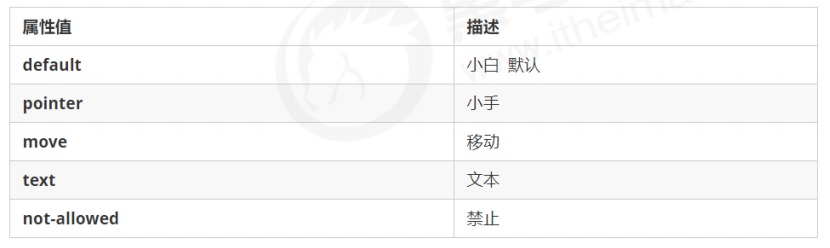

## 一、CSS层叠样式表

### 1.css简介

**CSS** 是层叠样式表 ( Cascading Style Sheets ) 的简。

有时我们也会称之为 CSS 样式表或级联样式表。

CSS 是也是一种标记语言，CSS 主要用于设置 HTML 页面中的文本内容（字体、大小、对齐方式等）、图片的外形（宽高、边框样式、边距等）以及版面的布局和外观显示样式。

- CSS语法规范

  CSS规则由两个主要的部分构成：选择器以及一条或多条声明。

  

  - 选择器是用于指定CSS样式的HTML标签，花括号内是对该对象设置的具体样式。
  - 属性和属性值以“键值对”的形式出现。
  - 属性是对指定的对象设置的样式属性，例如字体大小、文本颜色等。
  - 属性和属性值之间用英文“:”分开。
  - 多个“键值对”之间用英文“;”进行区分。

  所有的样式，都包含在 \<style> 标签内，表示是样式表。\<style> 一般写到 \</head> 上方。

  ```html
  <head>
   <style>
   h4 {
   color: blue;
   font-size: 100px;
   }
   </style>
  </head>
  ```


### 2.css基础选择器

选择器分为基础选择器和复合选择器两个大类。

基础选择器是由单个选择器组成的；

基础选择器又包括：标签选择器、类选择器、id选择器和通配符选择器。

##### 2.1 标签选择器

标签选择器（元素选择器）是指用 HTML 标签名称作为选择器，按标签名称分类，为页面中某一类标签指定统一的 CSS 样式。

语法：

```
标签名{

 属性1: 属性值1; 

 属性2: 属性值2; 

 属性3: 属性值3; 

 ...

} 
```

作用：标签选择器可以把某一类标签全部选择出来，比如所有的 \<div> 标签和所有的 \<span> 标签。

优点：能快速为页面中同类型的标签统一设置样式。

缺点：不能设计差异化样式，只能选择全部的当前标签。

##### 2.2 类选择器

如果想要差异化选择不同的标签，单独选一个或者某几个标签，可以使用类选择器。类选择器在 HTML 中以 class 属性表示，在 CSS 中，类选择器以一个点“.”号显示。

语法：

```css
类名 {

 属性1: 属性值1; 

 ...

} 
把所拥有的red类的HTML元素均为红色
.red {
 color: red;
}
结构需要用class属性来调用 class 类的意思
<div class=‘red’> 变红色 </div>
```

注意：

① 类选择器使用“.”（英文点号）进行标识，后面紧跟类名（自定义，我们自己命名的）。

② 可以理解为给这个标签起了一个名字，来表示。

③ 长名称或词组可以使用中横线来为选择器命名。

④ 不要使用纯数字、中文等命名，尽量使用英文字母来表示。

⑤ 命名要有意义，尽量使别人一眼就知道这个类名的目的。 

⑥ 命名规范：见附件（ Web 前端开发规范手册.doc）

##### 2.3 类选择器-多类名

我们可以给一个标签指定多个类名，从而达到更多的选择目的。 这些类名都可以选出这个标签。简单理解就是一个标签有多个名字。

- 多类名选择方式

  ```html
  <div class="red font20">亚瑟</div>
  ```

  (1) 在标签class 属性中写 多个类名

  (2) 多个类名中间必须用空格分开

  (3) 这个标签就可以分别具有这些类名的样式

- 多类名开发中使用场景

  (1) 可以把一些标签元素相同的样式(共同的部分)放到一个类里面.

  (2) 这些标签都可以调用这个公共的类,然后再调用自己独有的类.

  (3) 从而节省CSS代码,统一修改也非常方便。

  ```html
  <div class="pink fontWeight font20">亚瑟</div>
  <div class="font20">刘备</div>
  <div class="font14 pink">安其拉</div>
  <div class="font14">貂蝉</div>
  ```

  

##### 2.4 id选择器

id 选择器和类选择器的区别:

① 类选择器（class）好比人的名字，一个人可以有多个名字，同时一个名字也可以被多个人使用。

② id 选择器好比人的身份证号码，全中国是唯一的，不得重复。 

③ id 选择器和类选择器最大的不同在于使用次数上。

④ 类选择器在修改样式中用的最多，id 选择器一般用于页面唯一性的元素上，经常和 JavaScript 搭配使用。

##### 2.5 通配符选择器

在 CSS 中，通配符选择器使用“*”定义，它表示选取页面中所有元素（标签）。

语法：

```
 \* {

 属性1: 属性值1; 

 ...

} 
```

通配符选择器不需要调用， 自动就给所有的元素使用样式

特殊情况才使用，后面讲解使用场景(以下是清除所有的元素标签的内外边距)

```
* {

 margin: 0;

 padding: 0;

} 
```

##### 2.6 基础选择器总结

| 基础选择器   | 作用                          | 特点                             | 使用情况     | 用法            |
| ------------ | ----------------------------- | -------------------------------- | ------------ | --------------- |
| 标签选择器   | 可以选出所有相同的标签，比如p | 不能差异化选择                   | 较多         | p{color:red}    |
| 类选择器     | 可以选出1个或者多个标签       | 可以根据需求选择                 | 非常多       | .nav{color:red} |
| id选择器     | 一次只能选择1个标签           | ID属性只能在每个HTML文档出现一次 | 一般和js搭配 | #nav{color:red} |
| 通配符选择器 | 选择所有的标签                | 选择的太多，有部分不需要         | 特殊情况使用 | *{color:red}    |


### 3.css字体属性

CSS Fonts (字体)属性用于定义字体系列、大小、粗细、和文字样式（如斜体）。

##### 3.1 字体系列

CSS使用font-family属性定义文本的字体系列。

```html
p { font-family:"微软雅黑";} 
div {font-family: Arial,"Microsoft Yahei", "微软雅黑";}
/*优先找前面的字体显示*/
```

- 各种字体之间必须使用英文状态下的逗号隔开。

- 一般情况下，如果有空格隔开的多个单词组成的字体，加引号。

- 尽量使用系统默认自带字体，保证在任何用户的浏览器中都能正确显示。

- 最常见的几个字体：body {font-family: 'Microsoft YaHei',tahoma,arial,'Hiragino Sans GB'; }

  

##### 3.2 字体大小

CSS使用font-size属性定义字体的大小。

```html
p { 
 font-size: 20px; 
}
```

- px（像素）大小是我们网页的最常用的单位。
- 谷歌浏览器默认的文字大小是16px。
- 不同浏览器可能默认显示的字号大小不一致，尽量给一个明确的大小，不要默认大小。
- 可以给body指定整个页面文字的大小。
- 标题标签比较特殊，需要单独指定文字大小。

##### 3.3 字体粗细

CSS使用font-weight属性设置文本字体的粗细。

```html
p { 
 font-weight: bold;
}
```

| 属性值  | 描述                                                      |
| ------- | --------------------------------------------------------- |
| normal  | 默认值（不加粗的）                                        |
| bold    | 定义粗体（加粗的）                                        |
| 100-900 | 400等同于normal，而700等同于bold 注意这个数字后面不跟单位 |

- 学会让加粗标签（比如h和strong等）不加粗，或者其他标签加粗。
- 实际开发时，更喜欢用数字表示粗细。

##### 3.4 文字样式

CSS使用font-style属性设置文本风格。

```html
p{
font-style:normal;
}
```

| 属性值 | 作用                                                  |
| ------ | ----------------------------------------------------- |
| normal | 默认值，浏览器会显示标准的字体样式font-style: normal; |
| italic | 浏览器会显示斜体的字体样式                            |

注意：平时很少给文字加斜体，反而要给斜体标签（em, i）改为不倾斜字体。

##### 3.5 字体复合属性

字体属性可以把以上文字样式综合来写, 这样可以更节约代码:

```html
body { 
 font: font-style font-weight font-size/line-height font-family; }
```

- 使用font属性时，必须按上面语法格式中的顺序书写，不能更换顺序，并且各个属性见以空格隔开
- 不需要设置的属性可以省略（取默认值），但必须保留font-size和font-family属性，否则font属性将不起作用。

##### 3.6 字体属性总结

| 属性        | 表示     | 注意点                                                       |
| ----------- | -------- | ------------------------------------------------------------ |
| font-size   | 字号     | 通常单位是px像素，一定要带单位                               |
| font-family | 字体     | 实际工作中按照团队约定来书写字体                             |
| font-weight | 字体粗细 | 加粗是700或者bold, 不加粗是normal或者400，数字不加单位       |
| font-style  | 字体样式 | 倾斜是italic，不倾斜是normal，工作中常用normal               |
| font        | 字体连写 | 1.字体连写是有顺序的，不能随意更换位置 2.其中字号和字体必须同时出现 |


### 4.css文本属性

CSS Text（文本）属性可定义文本的**外观**，比如文本的颜色、对齐文本、装饰文本、文本缩进、行间距等。

##### 4.1 文本颜色

color 属性用于定义文本的颜色。

```html
div{
color:red;
}
```

| 表示           | 属性值                          |
| -------------- | ------------------------------- |
| 预定义的颜色值 | red,green,blue                  |
| 十六进制       | #FF0000, #FF6600, #29D794       |
| RGB代码        | rgb(255,0,0)或者rgb(100%,0%,0%) |

开发中最常用的是十六进制。

##### 4.2 对其文本

text-align属性用于设置元素内文本内容的水平对齐方式。

```html
div {
text-align:center;
}
```

| 属性值 | 解释     |
| ------ | -------- |
| left   | 左对齐   |
| right  | 右对齐   |
| center | 居中对齐 |

##### 4.3 装饰文本

text-decoration 属性规定添加到文本的修饰。可以给文本添加下划线、删除线、上划线等。

```html
div { 
 text-decoration：underline； }
```

| 属性值       | 描述                            |
| ------------ | ------------------------------- |
| none         | 默认，没有装饰线（最常用）      |
| underline    | 下划线，链接a自带下划线（常用） |
| overline     | 上划线（几乎不同）              |
| line-througt | 删除线（不常用)                 |

##### 4.4 文本缩进

text-indent 属性用来指定文本的第一行的缩进，通常是将段落的首行缩进。

```html
div { 
 text-indent: 10px;
}
```

通过设置该属性，所有元素的第一行都可以缩进一个给定的长度，甚至该长度可以是负值。

```html
p { 
 text-indent: 2em;
}
```

em 是一个相对单位，就是当前元素（font-size) 1 个文字的大小, 如果当前元素没有设置大小，则会按照父元素的 1 个文字大小。

##### 4.5 行间距

line-height 属性用于设置行间的距离（行高）。可以控制文字行与行之间的距离。

```html
p { 
 line-height: 26px;
}
```


##### 4.6 文本属性总结

| 属性            | 表示     | 注意点                                               |
| --------------- | -------- | ---------------------------------------------------- |
| color           | 文本颜色 | 通常用十六进制，而且是简单形式#fff                   |
| text-align      | 文本对齐 | 可以设定文字水平的对齐方式                           |
| text-indent     | 文本缩进 | 通常我们用于段落首行缩进2个字的距离 text-indent:2em; |
| text-decoration | 文本修饰 | 记住添加下划线 underline，取消下划线 none            |
| line-height     | 行高     | 控制行与行之间的距离                                 |

### 5.css的引入方式

##### 5.1 CSS的三种样式表

按照 CSS 样式书写的位置（或者引入的方式），CSS 样式表可以分为三大类：

1. 行内样式表（行内式）

2. 内部样式表（嵌入式）

3. 外部样式表（链接式）

##### 5.2 内部样式表

内部样式表（内嵌样式表）是写到html页面内部. 是将所有的 CSS 代码抽取出来，单独放到一个 \<style> 标签中。 

```html
<style>
 div {
 color: red;
 font-size: 12px;
 }
</style>
```

- \<style>标签理论上可以放在HTML文档的任何地方，但是一般会放在文档的\<head>标签中。
- 通过此种方式，可以方便控制当前整个页面中的元素样式设置。
- 代码结构清晰，但是并没有实现结构与样式完全分离。
- 使用内部样式表设定 CSS，通常也被称为**嵌入式引入**，这种方式是我们练习时常用的方式。

##### 5.3 行内样式表

行内样式表（内联样式表）是在元素标签内部的 style 属性中设定 CSS 样式。适合于修改简单样式。

```html
<div style="color: red; font-size: 12px;">青春不常在，抓紧谈恋爱</div>
```

- style 其实就是标签的属性
- 在双引号中间，写法要符合 CSS 规范
- 可以控制当前的标签设置样式
- 由于书写繁琐，并且没有体现出结构与样式相分离的思想，所以不推荐大量使用，只有对当前元素添加简单样式的时候，可以考虑使用
- 使用行内样式表设定 CSS，通常也被称为**行内式引入**

##### 5.4 外部样式表

实际开发都是外部样式表. 适合于样式比较多的情况. 核心是:样式单独写到CSS 文件中，之后把CSS文件引入到 HTML 页面中使用。

引入外部样式表分为两步：

1. 新建一个后缀名为 .css 的样式文件，把所有 CSS 代码都放入此文件中。

2. 在 HTML 页面中，使用\<link> 标签引入这个文件。

```html
<link rel="stylesheet" href="css文件路径">
```

| 属性 | 作用                                                         |
| ---- | ------------------------------------------------------------ |
| rel  | 定义当前文档与被链接文档之间的关系，在这里需要指定为“stylesheet”，表示被链接的文档是一个样式表文件。 |
| href | 定义所链接外部样式表文件的URL，可以是相对路径，也可以是绝对路径。 |

- 使用外部样式表设定 CSS，通常也被称为**外链式**或**链接式引入**，这种方式是开发中常用的方式。

##### 5.4 CSS引入方式总结

| 样式表     | 优点                     | 缺点         | 使用情况 | 控制范围     |
| ---------- | ------------------------ | ------------ | -------- | ------------ |
| 行内样式表 | 书写方便，权重高         | 结构样式混写 | 较少     | 控制一个标签 |
| 内部样式表 | 部分结构和样式相分离     | 没有彻底分离 | 较多     | 控制一个页面 |
| 外部样式表 | 完全实现结构和样式相分离 | 需要引入     | 最多     | 控制多个页面 |

### 6.Emmet语法

Emmet语法的前身是Zen coding,它使用缩写，来提高html/css的编写速度，Vscode内部已经集成该语法。

- 快速生成HTML结构

  生成多个相同标签：div*3

  父子级关系：ul>li

  兄弟并列关系：div+p

  带有类名或者id名字：.demo 或者#two tab键就可以了

  生成的div类名有顺序，用自增符号$: .demo$*5

  在生成的标签内部写内容：div{文字}

  ```html
  <!-- div{$}*5 -->
      <div>1</div>
      <div>2</div>
      <div>3</div>
      <div>4</div>
      <div>5</div>
  ```

- 快速生成CSS样式语法

  CSS 基本采取简写形式即可.

  1. 比如 w200 按tab 可以 生成 width: 200px;

  2. 比如 lh26px 按tab 可以生成 line-height: 26px;

### 7.CSS的复合选择器

在 CSS 中，可以根据选择器的类型把选择器分为基础选择器和复合选择器，复合选择器是建立在基础选择器之上，对基本选择器进行组合形成的。 

- 复合选择器可以更准确更高效的选择目标元素(标签)。
- 复合选择器是由两个或者多个基础选择器，通过不同的方式组合而成的。
- 常用的复合选择器包括：后代选择器、子代选择器、并集选择器、伪类选择器等等。

##### 7.1 后代选择器

**后代选择器**又称为包含选择器，可以选择父元素里面子元素。其写法就是把外层标签写在前面，内层标签写在后面，中间用空格分隔。当标签发生嵌套时，内层标签就成为外层标签的后代。

语法：元素1 元素2 {样式声明}

上述语法表示选择元素1里面的所有元素2（后代元素）。

例子：

```html
ul li {样式声明}
```

-  元素1 和 元素2 中间用**空格隔开**

-  元素1 是父级，元素2 是子级，最终选择的是**元素2** 

-  元素2 可以是儿子，也可以是孙子等，只要是元素1 的后代即可 

-  元素1 和 元素2 可以是任意基础选择器

##### 7.2 子代选择器

子元素选择器（子选择器）只能选择作为某元素的最近一级子元素。简单理解就是选亲儿子元素。

语法：元素1>元素2（样式声明）

上述语法表示选择元素1 里面的所有直接后代(子元素) 元素2。

例如：

```html
div > p { 样式声明 } /* 选择 div 里面所有最近一级 p 标签元素 */
```

- 元素1 和 元素2 中间用 **大于号** 隔开。

- 元素1 是父级，元素2 是子级，最终选择的是**元素2** 。

- 元素2 必须是**亲儿子，**其孙子、重孙之类都不归他管. 你也可以叫他 亲儿子选择器。

##### 7.3 并集选择器

并集选择器可以选择多组标签, 同时为他们定义相同的样式。通常用于集体声明。

**并集选择器**是各选择器通过英文逗号（,）连接而成，任何形式的选择器都可以作为并集选择器的一部分。

语法：元素1，元素2 {样式声明}

上述语法表示选择元素1 和 元素2。

例如：

```html
ul,div { 样式声明 } /* 选择 ul 和 div标签元素 */
```

- 元素1 和 元素2 中间用逗号隔开

- 逗号可以理解为和的意思

- 并集选择器通常用于集体声明

##### 7.4 伪类选择器

伪类选择器用于向某些选择器添加特殊的效果，比如给链接添加特殊效果，或选择第1个，第n个元素。

伪类选择器书写最大的特点是用冒号（:）表示，比如 :hover 、 :first-child 。

因为伪类选择器很多，比如有链接伪类、结构伪类、表单伪类等，所以这里先给大家讲解常用的链接伪类选择器。

##### 7.5 链接伪类选择器

```html
a:link  /*选择所有未被访问的链接*/
a:visited  /*选择所有已被访问的链接*/
a:hover   /*选择鼠标指针位于其上的链接*/
a:activate   /*选择活动链接（鼠标按下未弹起的链接）*/
```

- 链接伪类选择器注意事项

1. 为了确保生效，请按照 LVHA 的循顺序声明 :link－:visited－:hover－:active。

2. 记忆法：love hate 或者 lv 包包 hao 。

3. 因为 a 链接在浏览器中具有默认样式，所以我们实际工作中都需要给链接单独指定样式。

- 链接伪类选择器实际工作开发中的写法：

  ```html
  /* a 是标签选择器 所有的链接 */ 
   a { 
   color: gray;
   }
   /* :hover 是链接伪类选择器 鼠标经过 */
   a:hover { 
   color: red; /* 鼠标经过的时候，由原来的 灰色 变成了红色 */
   }
  ```

##### 7.6 :focus选择器

:focus 伪类选择器用于选取获得焦点的表单元素。

焦点就是光标，一般情况 \<input> 类表单元素才能获取，因此这个选择器也主要针对于表单元素来说。

```html
input:focus { 
 background-color:yellow;
}
```


##### 7.7 复合选择器总结

| 选择器         | 作用                   | 特征             | 使用情况 | 隔开符号及用法                     |
| -------------- | ---------------------- | ---------------- | -------- | ---------------------------------- |
| 后代选择器     | 用来选择后代元素       | 可以是子孙后代   | 较多     | 符号是空格.nav a                   |
| 子代选择器     | 选择最近一级元素       | 之选亲儿子       | 较少     | 符号是大于.nav>p                   |
| 并集选择器     | 选择某些相同样式的元素 | 可以用于集体声明 | 较多     | 符号是.nav, .header                |
| 链接伪类选择器 | 选择不同状态的链接     | 跟链接相关       | 较多     | 重点记住a{}和a:hover实际开发的写法 |
| :focus选择器   | 选择获得光标的表单     | 跟表单相关       | 较少     | input:focus 记住此写法             |


### 8.CSS的元素显示模式

了解元素的显示模式可以更好的让我们布局页面。

1. 什么是元素的显示模式

   作用：网页的标签非常多，在不同地方会用到不同类型的标签，了解他们的特点可以更好的布局我们的网页。

   元素显示模式就是元素（标签）以什么方式进行显示，比如\<div>自己占一行，比如一行可以放多个\<span>。

2. 元素显示模式的分类

   HTML 元素一般分为块元素和行内元素两种类型。

3. 元素显示模式的转换

##### 8.1 块元素

常见的块元素有<h1>~<h6>、<p>、<div>、<ul>、<ol>、<li>等，其中 <div> 标签是最典型的块元素。

块级元素的特点： 

① 比较霸道，自己独占一行。 

② 高度，宽度、外边距以及内边距都可以控制。

③ 宽度默认是容器（父级宽度）的100%。 

④ 是一个容器及盒子，里面可以放行内或者块级元素。

注意：

- 文字类的元素内不能使用块级元素
- \<p>标签主要用于存放文字，因此\<p>里面不能放块级元素，特别是不能放\<div>
- 同理，\<h1>~\<h6>等都是文字类块级标签，里面也不能放其他块级元素

##### 8.2 行内元素

常见的行内元素有 \<a>、\<strong>、\<b>、\<em>、\<i>、\<del>、\<s>、\<ins>、\<u>、\<span>等，其中\<span> 标签是最典型的行内元素。有的地方也将行内元素称为内联元素。

行内元素的特点： 

① 相邻行内元素在一行上，一行可以显示多个。

② 高、宽直接设置是无效的。

③ 默认宽度就是它本身内容的宽度。

④ 行内元素只能容纳文本或其他行内元素。

注意：

- 链接里面不能再放链接

- 特殊情况链接 \<a> 里面可以放块级元素，但是给 \<a> 转换一下块级模式最安全

##### 8.3 行内块元素

在行内元素中有几个特殊的标签 —— \、\<input />、\<td>，它们同时具有块元素和行内元素的特点。有些资料称它们为行内块元素。

行内块元素的特点： 

① 和相邻行内元素（行内块）在一行上，但是他们之间会有空白缝隙。一行可以显示多个（行内元素特点）。

② 默认宽度就是它本身内容的宽度（行内元素特点）。

③ 高度，行高、外边距以及内边距都可以控制（块级元素特点）。

##### 8.4 元素显示模式总结

| 元素模式   | 元素排列               | 设置样式               | 默认宽度           | 包含                     |
| ---------- | ---------------------- | ---------------------- | ------------------ | ------------------------ |
| 块级元素   | 一行只能放一个块级元素 | 可以设置宽度高度       | 容器的100%         | 容器可以包含任何标签     |
| 行内元素   | 一行可以放多个行内元素 | 不可以直接设置宽度高度 | 它本身的内容的宽度 | 容纳文本或者其他行内元素 |
| 行内块元素 | 一行放多个行内块元素   | 可以设置宽度和高度     | 它本身内容的宽度   |                          |

##### 8.5元素显示模式转换

特殊情况下，我们需要元素模式的转换，简单理解: 一个模式的元素需要另外一种模式的特性

比如想要增加链接 \<a> 的触发范围。 

- 转换为块元素：display:block;
- 转换为行内元素：display:inline;
- 转换为行内块：display: inline-block;

##### 8.6 单行文字垂直居中的原理

解决方案: 让文字的行高等于盒子的高度 就可以让文字在当前盒子内垂直居中。


简单理解: 行高的上空隙和下空隙把文字挤到中间了. 是如果行高小于盒子高度,文字会偏上,如果行高大于盒子高度,则文字偏下。

### 9.CSS的背景

通过CSS背景属性，可以给页面添加背景样式。

背景属性可以设置背景颜色、背景图片、背景平铺、背景图片位置、背景图像固定等。

##### 9.1 背景颜色

background-color 属性定义了元素的背景颜色。

一般情况下元素背景颜色默认值是 transparent（透明），我们也可以手动指定背景颜色为透明色。

```html
background-color:transparent;
```

##### 9.2 背景图片

background-image 属性描述了元素的背景图像。实际开发常见于 logo 或者一些装饰性的小图片或者是超大的背景图片, 优点是非常便于控制位置. (精灵图也是一种运用场景)

```html
background-image : none | url (url)
```

| 参数值 | 作用                             |
| ------ | -------------------------------- |
| none   | 无背景图（默认的）               |
| url    | 使用绝对或者相对地址指定背景图片 |

注意：背景图片后面的地址，千万不要忘记加URL，同时里面的路径不要加引号。

##### 9.3 背景平铺

如果需要在 HTML 页面上对背景图像进行平铺，可以使用 background-repeat 属性。

```html
background-repeat: repeat | no-repeat | repeat-x | repeat-y
```

| 参数值    | 作用                               |
| --------- | ---------------------------------- |
| repeat    | 背景图像在纵向和横向上平铺（默认） |
| no-repeat | 背景图像不平铺                     |
| repeat-x  | 背景图像在横向上平铺               |
| repeat-y  | 背景图片在纵向上平铺               |

##### 9.4 背景图片位置

利用 background-position 属性可以改变图片在背景中的位置。

```html
background-position: x y;
```

参数代表的意思是：x 坐标和 y 坐标。 可以使用 方位名词 或者 精确单位。

| 参数值   | 说明                                              |
| -------- | ------------------------------------------------- |
| length   | 百分数\|由浮点数字和单位标识符组成的长度值        |
| position | top\|center\|bottom\|left\|center\|right 方位名词 |

1. 参数是方位名词

- 如果指定的两个值都是方位名词，则两个值前后顺序无关，比如 left top 和 top left 效果一致

- 如果只指定了一个方位名词，另一个值省略，则第二个值默认居中对齐

2. 参数是精确单位

-  如果参数值是精确坐标，那么第一个肯定是 x 坐标，第二个一定是 y 坐标

-  如果只指定一个数值，那该数值一定是 x 坐标，另一个默认垂直居中

3. 参数是混合单位

-  如果指定的两个值是精确单位和方位名词混合使用，则第一个值是 x 坐标，第二个值是 y 坐标

##### 9.5 背景图像固定

background-attachment 属性设置背景图像是否固定或者随着页面的其余部分滚动。

background-attachment 后期可以制作视差滚动的效果。

```html
background-attachment : scroll | fixed
```

| 参数   | 作用                               |
| ------ | ---------------------------------- |
| scroll | 背景图像是随着对象内容滚动（默认） |
| fixed  | 背景图像固定                       |

##### 9.6 背景复合写法

为了简化背景属性的代码，我们可以将这些属性合并简写在同一个属性 background 中。从而节约代码量。

当使用简写属性时，没有特定的书写顺序,一般习惯约定顺序为：

background: 背景颜色 背景图片地址 背景平铺 背景图像滚动 背景图片位置;

```html
background: transparent url(image.jpg) repeat-y fixed top ;
```

这是实际开发中，我们更提倡的写法。

##### 9.7 背景色半透明

CSS3 为我们提供了背景颜色半透明的效果。

```html
background: rgba(0, 0, 0, 0.3);
```

-  最后一个参数是 alpha 透明度，取值范围在 0~1之间

-  我们习惯把 0.3 的 0 省略掉，写为 background: rgba(0, 0, 0, .3);

-  注意：背景半透明是指盒子背景半透明，盒子里面的内容不受影响

-  CSS3 新增属性，是 IE9+ 版本浏览器才支持的 

-  但是现在实际开发,我们不太关注兼容性写法了,可以放心使用

##### 9.8 背景总结

| 属性                  | 作用           | 值                                                 |
| --------------------- | -------------- | -------------------------------------------------- |
| background-color      | 背景颜色       | 预定义的颜色值/十六进制/RGB代码                    |
| background-image      | 背景图片       | url（图片路径）                                    |
| background-repeat     | 是否平铺       | repeat/no-repeat/repeat-x/repeat-y                 |
| background-position   | 背景位置       | length/position 分别是x和y坐标                     |
| background-attachment | 背景附着       | scroll（北京滚动）/fixed（背景固定）               |
| 背景简写              | 书写更简单     | 背景颜色 背景图片地址 背景平铺 背景滚动 背景位置； |
| 背景色半透明          | 背景颜色半透明 | background: rgba(0,0,0,0.3);后面必须是4个值        |

背景图片:实际开发常见于 logo 或者一些装饰性的小图片或者是超大的背景图片, 优点是非常便于控制位置。(精灵图也是一种运用场景)

### 10.CSS的三大特性

CSS有三个非常重要的特性：层叠行、继承性、优先级。

##### 10.1 层叠性

相同选择器给设置相同的样式，此时一个样式就会覆盖（层叠）另一个冲突的样式。层叠性主要解决样式冲突的问题。

##### 10.2 继承性

CSS中的继承：子标签会继承父标签的某些样式，如文本的颜色和字号。简单理解就是：子承父业。

- 恰当的继承可以简化代码，降低CSS样式的复杂性
- 子元素可以继承父元素的样式（text-，font-，line- 这些元素开头的可以继承，以及color属性），盒子高度，盒子模型...不能继承。

行高的继承

```html
 body {
            color: pink;
            /* font: 12px/24px 'Microsoft YaHei'; */
            font: 12px/1.5 'Microsoft YaHei';
        }

        div {
            /* 子元素继承了父元素 body 的行高 1.5 */
            /* 这个1.5 就是当前元素文字大小 font-size 的1.5倍   所以当前div 的行高就是21像素 */
            font-size: 14px;
        }

        p {
            /* 1.5 * 16 =  24 当前的行高 */
            font-size: 16px;
        }
```

行高可以跟单位也可以不跟单位。

##### 10.3 优先级

选择器权重如下所示。

| 选择器               | 选择器权重 |
| -------------------- | ---------- |
| 继承 或者*           | 0，0，0，0 |
| 元素（标签）选择器   | 0，0，0，1 |
| 类选择器，伪类选择器 | 0，0，1，0 |
| ID选择器             | 0，1，0，0 |
| 行内样式 style=""    | 1，0，0，0 |
| !important 重要的    | =无穷大    |

注意点：

1. 权重是有4位数字组成，但不会有进位。
2. 可以理解为类选择器永远大于元素选择器，id选择器永远大于类选择器，以此类推。
3. 等级判断从左到右，如果某一位数字相同，则判断下一位数值。
4. 继承的权重为0，如果该元素没有直接选中，不管父元素权重多高，子元素得到的权重都是0。

权重叠加：如果是复合选择器，则会有权重叠加，需要计算权重。


## 二、盒子模型

### 1.盒子模型

页面布局要学习三大核心, 盒子模型, 浮动 和 定位。学习好盒子模型能非常好的帮助我们布局页面。

##### 网页布局的本质

网页布局的过程：

1. 先准备好相关的网页元素，网页元素基本都是盒子Box。
2. 利用CSS设置好盒子样式，然后摆放到相应位置。
3. 往盒子里面装内容。

网页布局的核心本质：就是利用CSS摆盒子。

##### 盒子模型组成


所谓 盒子模型：就是把 HTML 页面中的布局元素看作是一个矩形的盒子，也就是一个盛装内容的容器。

CSS 盒子模型本质上是一个盒子，封装周围的 HTML 元素，它包括：边框、外边距、内边距、和 实际内容。


##### 边框（border）

border可以设置元素的边框。边框有三部分组成:边框宽度(粗细) 边框样式 边框颜色。

CSS 边框属性允许你指定一个元素边框的样式和颜色。

语法：

```html
border : border-width || border-style || border-color
```

| 属性         | 作用                   |
| ------------ | ---------------------- |
| border-width | 定义边框粗细，单位是px |
| border-style | 边框样式               |
| border-color | 边框颜色               |

边框样式 border-style 可以设置如下值：

- none：没有边框即忽略所有边框的宽度（默认值）
- solid：边框为单实线（最为常用）
- dashed：边框为虚线
- dotted：边框为点线

边框简写：

```html
border:1px solid red;  没有顺序
```

边框分开写法：

```html
border-top: 1px solid red; /*只设定上边框，其余同理*/
```


##### 表格的细线边框

border-collapse 属性控制浏览器绘制表格边框的方式。它控制相邻单元格的边框。

语法：

```html
border-collapse:collapse;
```

- collapse是合并的意思
- border-collapse: collapse; 表示相邻边框合并在一起

##### 边框会影响盒子实际的大小

边框会额外增加盒子的实际大小。因此我们有两种方案解决:

1. 测量盒子大小的时候,不量边框。
2. 如果测量的时候包含了边框,则需要 width/height 减去边框宽度。

##### 内边距（padding）

padding属性用于设置内边距，即边框与内容之间的距离。

| 属性           | 作用     |
| -------------- | -------- |
| padding-left   | 左内边距 |
| padding-right  | 右内边距 |
| padding-top    | 上内边距 |
| padding-bottom | 下内边距 |

padding 属性（简写属性）可以有一到四个值。

| 值的个数                    | 表达的意思                                                 |
| --------------------------- | ---------------------------------------------------------- |
| padding: 5px;               | 1个值，代表上下左右都有5像素内边距                         |
| padding: 5px 10px;          | 2个值，代表上下内边距是5像素，左右内边距是10像素           |
| padding: 5px 10px 20px      | 3个值，代表上内边距5像素，左右内边距10像素，下内边距20像素 |
| padding: 5px 10px 20px 30px | 4个值，上是5像素，右10，下20，左30                         |

当我们给盒子指定 padding 值之后，发生了 2 件事情：

1. 内容和边框有了距离，添加了内边距。

2. padding影响了盒子实际大小。

也就是说，如果盒子已经有了宽度和高度，此时再指定内边框，会撑大盒子。

解决办法：如果保证盒子跟效果图大小保持一致，则让 width/height 减去多出来的内边距大小即可。

**如何盒子本身没有指定width/height属性, 则此时padding不会撑开盒子大小。**

##### 外边距（margin）

margin 属性用于设置外边距，即控制盒子和盒子之间的距离。

| 属性          | 作用     |
| ------------- | -------- |
| margin-left   | 左外边距 |
| margin-right  | 右外边距 |
| margin-top    | 上外边距 |
| margin-bottom | 下外边距 |

margin的简写方式代表的意义和padding完全一致。

##### 外边距典型应用

外边距可以让块级盒子**水平居中**，但是必须满足两个条件：

① 盒子必须指定了宽度（width）。

② 盒子左右的外边距都设置为 auto 。 

```html
.header{width:960px; margin:0 auto}
```

常见的写法，以下三种都可以：

- margin-left: auto; margin-right: auto;
- margin: auto;
- margin: 0 auto;

注意：以上方法是让**块级元素**水平居中，行内元素或者行内块元素水平居中给其父元素添加 text-align:center 即可。

##### 外边距合并

使用 margin 定义块元素的垂直外边距时，可能会出现外边距的合并。

主要右两种情况：

1. 相邻块元素垂直外边距的合并
2. 嵌套块元素垂直外边距的塌陷

- 相邻块元素垂直外边距的合并

  当上下相邻的两个块元素（兄弟关系）相遇时，如果上面的元素有下外边距 margin-bottom，下面的元素有

  上外边距 margin-top ，则他们之间的垂直间距不是 margin-bottom 与 margin-top 之和。取两个值中的

  较大者这种现象被称为**相邻块元素垂直外边距的合并**。解决办法：尽量只给一个盒子添加 margin 值。

   

- 嵌套块元素垂直外边距的塌陷

  对于两个嵌套关系（父子关系）的块元素，父元素有上外边距同时子元素也有上外边距，此时父元素会塌陷较大的外边距值。

  

解决方案：

① 可以为父元素定义上边框。 

② 可以为父元素定义上内边距。 

③ **可以为父元素添加 overflow:hidden。**

还有其他方法，比如浮动、固定，绝对定位的盒子不会有塌陷问题，后面再总结。

##### 清除内外边距

网页元素很多都带有默认的内外边距，而且不同浏览器默认的也不一致。因此我们在布局前，首先要清除下网页元素的内外边距。

```html
* {
 padding:0; /* 清除内边距 */
 margin:0; /* 清除外边距 */
 }
```

**注意：**行内元素为了照顾兼容性，尽量只设置左右内外边距，不要设置上下内外边距。但是转换为块级和行内块元素就可以了。

### 2.PS基本操作

因为网页美工大部分效果图都是利用 PS（Photoshop）来做的，所以以后我们大部分切图工作都是在 PS 里面完成。 

- 文件——>打开 ：可以打开我们要测量的图片

- Ctrl+R：可以打开标尺，或者 视图——>标尺

- 右击标尺，把里面的单位改为像素 

- Ctrl+ 加号(+)可以放大视图， 

- Ctrl+ 减号(-)可以缩小视图

- 按住空格键，鼠标可以变成小手，拖动 PS 视图

- 用选区拖动 可以测量大小

- Ctrl+ D 可以取消选区，或者在旁边空白处点击一下也可以取消选区

### 3.综合案例

##### 布局要点

1. 布局为啥用不同盒子,我只想用div？

标签都是有语义的, 合理的地方用合理的标签。比如产品标题 就用 h, 大量文字段落就用p

2. 为啥用辣么多类名？

类名就是给每个盒子起了一个名字,可以更好的找到这个盒子, 选取盒子更容易,后期维护也方便。

3. 到底用 margin 还是 padding？

大部分情况两个可以混用，两者各有优缺点，但是根据实际情况，总是有更简单的方法实现。

4. 自己做没有思路？

布局有很多种实现方式，同学们可以开始先模仿写法，然后再做出自己的风格。

#####  去掉 li 前面的 项目符号(小圆点)

语法：

```html
list-style: none
```

### 4.圆角边框

在 CSS3 中，新增了圆角边框样式，这样我们的盒子就可以变圆角了。

border-radius 属性用于设置元素的外边框圆角。

语法：

```html
border-radius: length
```

- 参数值可以为数值或百分比的形式

- 如果是正方形，想要设置为一个圆，把数值修改为高度或者宽度的一半即可，或者直接写为 50%

- 该属性是一个简写属性，可以跟四个值，分别代表左上角、右上角、右下角、左下角 

- 分开写：border-top-left-radius、border-top-right-radius、border-bottom-right-radius 和 border-bottom-left-radius

- 兼容性 ie9+ 浏览器支持, 但是不会影响页面布局,可以放心使用.

### 5.盒子阴影

CSS3 中新增了盒子阴影，我们可以使用 box-shadow 属性为盒子添加阴影。

语法：

```html
box-shadow: h-shadow v-shadow blur spread color inset;
```

| 值       | 描述                                   |
| -------- | -------------------------------------- |
| h-shadow | 必需。水平阴影的位置，允许负值         |
| v-shadow | 必须。垂直阴影的位置，允许负值         |
| blur     | 可选。模糊距离                         |
| spread   | 可选。阴影的尺寸                       |
| color    | 可选。阴影的颜色，参阅css颜色值        |
| inset    | 可选。将外部阴影（outset）改为内部阴影 |

注意：

1. 默认的是外阴影(outset), 但是不可以写这个单词,否则造成阴影无效
2. 盒子阴影不占用空间，不会影响其他盒子排列。

### 6.文字阴影

在 CSS3 中，我们可以使用 text-shadow 属性将阴影应用于文本。

语法：

```html
text-shadow: h-shadow v-shadow blur color;
```

| 值       | 描述                            |
| -------- | ------------------------------- |
| h-shadow | 必需。水平阴影的位置，允许负值  |
| v-shadow | 必须。垂直阴影的位置，允许负值  |
| blur     | 可选。模糊距离                  |
| color    | 可选。阴影的颜色，参阅css颜色值 |

## 三、CSS浮动

### 1.浮动

##### 传统网页布局的三种方式

网页布局的本质——用 CSS 来摆放盒子。 把盒子摆放到相应位置。

CSS 提供了三种传统布局方式(简单说,就是盒子如何进行排列顺序)： 

- 普通流（标准流）
- 浮动
- 定位

##### 标准流（普通流/文档流）

所谓的标准流: 就是标签按照规定好默认方式排列。

1. 块级元素会独占一行，从上向下顺序排列。 

   常用元素：div  hr p h1~h6 ul ol dl form table

2. 行内元素会按照顺序，从左到右顺序排列，碰到父元素边缘则自动换行。 

   常用元素：span a i em等

以上都是标准流布局，标准流是最基本的布局方式。

这三种布局方式都是用来摆放盒子的，盒子摆放到合适位置，布局自然就完成了。

**注意：**实际开发中，一个页面基本都包含了这三种布局方式（后面移动端学习新的布局方式） 。

##### 为什么需要浮动

1. 如何让多个块级盒子(div)水平排列成一行？

2. 如何实现两个盒子的左右对齐？

总结： 

有很多的布局效果，标准流没有办法完成，此时就可以利用浮动完成布局。 因为浮动可以改变元素标签默认的排列方式。

浮动最典型的应用：可以让多个块级元素一行内排列显示。

网页布局第一准则：多个块级元素纵向排列找标准流，多个块级元素横向排列找浮动。

##### 什么是浮动

float 属性用于创建浮动框，将其移动到一边，直到左边缘或右边缘触及包含块或另一个浮动框的边缘。

语法：

```html
选择器 {float:属性值；}
```

| 属性值 | 描述                 |
| ------ | -------------------- |
| none   | 元素不浮动（默认值） |
| left   | 元素向左浮动         |
| right  | 元素向右浮动         |

##### 浮动特性

- 浮动元素会脱离标准流（脱标）

  脱离标准普通流的控制（浮） 移动到指定位置（动）, （俗称脱标）。

  浮动的盒子不再保留原先的位置。

- 浮动的元素会一行内显示并且元素顶部对齐

  如果多个盒子都设置了浮动，则它们会按照属性值一行内显示并且顶端对齐排列。

  注意：浮动的元素是互相贴靠在一起的（不会有缝隙），如果父级宽度装不下这些浮动的盒子， 多出的盒子会另起一行对齐。

- 浮动的元素会具有行内块元素的特性

  任何元素都可以浮动。不管原先是什么模式的元素，添加浮动之后具有**行内块元素**相似的特性。

  - 如果块级盒子没有设置宽度，默认宽度和父级一样宽，但是添加浮动后，它的大小根据内容来决定
  - 浮动的盒子中间是没有缝隙的，是紧挨着一起的
  - 行内元素同理

##### 浮动元素经常和标准流父级搭配使用

为了约束浮动元素位置, 我们网页布局一般采取的策略是：

网页布局第一准侧：先用标准流的父元素排列上下位置, 之后内部子元素采取浮动排列左右位置。


网页布局第二准侧：先设置盒子的大小, 之后设置盒子的位置。

### 2.常见网页布局


浮动布局注意点：

- 浮动和标准流的父盒子搭配

  先用标准流的父元素排列上下位置, 之后内部子元素采取浮动排列左右位置

- 一个元素浮动了，理论上其余的兄弟元素也要浮动

  一个盒子里面有多个子盒子，如果其中一个盒子浮动了，那么其他兄弟也应该浮动，以防止引起问题。浮动的盒子只会影响浮动盒子后面的标准流,不会影响前面的标准流。

### 3.清除浮动

##### 为什么需要清除浮动？

由于父级盒子很多情况下，不方便给高度，但是子盒子浮动又不占有位置，最后父级盒子高度为 0 时，就会影响下面的标准流盒子。


由于浮动元素不再占用原文档流的位置，所以它会对后面的元素排版产生影响。

##### 清除浮动本质

- 清除浮动的本质是清除浮动元素造成的影响。
- 如果父盒子本身有高度，则不需要清除浮动。
- 清除浮动之后，父级就会根据浮动的子盒子自动检测高度。父级有了高度，就不会影响下面的标准流了。

##### 清除浮动

语法：

```html
选择器{clear: 属性值；}
```

| 属性值 | 描述                                       |
| ------ | ------------------------------------------ |
| left   | 不允许左侧有浮动元素（清除左侧浮动的影响） |
| right  | 不允许右侧有浮动元素（清楚右侧浮动的影响） |
| both   | 同时清除左右两侧浮动的影响                 |

实际工作中， 几乎只用 clear: both;

清除浮动的策略是: 闭合浮动. 

##### 清除浮动的方法

1. 额外标签法也称为隔墙法，是 W3C 推荐的做法。

2. 父级添加 overflow 属性

3. 父级添加after伪元素

4. 父级添加双伪元素

##### 清除浮动-额外标签法

**额外标签法**也称为隔墙法，是 W3C 推荐的做法。

额外标签法会在浮动元素末尾添加一个空的标签。例如 \<div style="clear:both">\</div>，或者其他标签（如\<br />等）

- 优点：通俗易懂，书写方便

- 缺点：添加许多无意义的标签，结构比较差

  **注意： 要求这个新的空标签必须是块级元素。**

总结:

1. 清除浮动本质是? 

   清除浮动的本质是清除浮动元素脱离标准流造成的影响

2. 清除浮动策略是?

   闭合浮动. 只让浮动在父盒子内部影响,不影响父盒子外面的其他盒子.

3. 额外标签法?

   隔墙法, 就是在最后一个浮动的子元素后面添加一个额外标签, 添加 清除浮动样式.

   实际工作可能会遇到,但是不常用

##### 清除浮动-父级添加overflow

可以给父级添加 overflow 属性，将其属性值设置为 hidden、 auto 或 scroll 。

子不教,父之过,注意是给父元素添加代码

- 优点：代码简洁
- 缺点：无法显示溢出的部分

##### 清除浮动-:after伪元素法

:after 方式是额外标签法的升级版。也是给父元素添加

```html
.clearfix:after { 
 content: ""; 
 display: block; 
 height: 0; 
 clear: both; 
 visibility: hidden; 
} 
.clearfix { /* IE6、7 专有 */ 
 *zoom: 1;
}
```

- 优点：没有增加标签，结构更简单
- 缺点：照顾低版本浏览器
- 代表网站： 百度、淘宝网、网易等

##### 清除浮动-双伪元素清除浮动

也是给父元素添加

```html
.clearfix:before,
.clearfix:after {
 content:"";
 display:table; 
}

.clearfix:after {
 clear:both; 
}

.clearfix {
 *zoom:1;
}
```

- 优点：代码更简洁
- 缺点：照顾低版本浏览器
- 代表网站：小米、腾讯等

##### 清除浮动总结

清除浮动的理由：

① 父级没高度。 

② 子盒子浮动了。 

③ 影响下面布局了，我们就应该清除浮动了。

| 清除浮动的方式        | 优点               | 缺点                              |
| --------------------- | ------------------ | --------------------------------- |
| 额外标签法（隔墙法）  | 通俗易懂，书写方便 | 添加许多无意义标签，结构化较差    |
| 父级overflow: hidden; | 书写方便           | 溢出隐藏                          |
| 父级after伪元素       | 结构语义化正确     | 由于IE6-7不支持:after，兼容性问题 |
| 父级双伪元素          | 结构语义化正确     | 由于IE6-7不支持:after，兼容性问题 |

### 4.PS切图

### 5.学成在线案例

#####  CSS 属性书写顺序

建议遵循以下顺序：

1. 布局定位属性：display / position / float / clear / visibility / overflow（建议 display 第一个写，毕竟关系到模式）

2. 自身属性：width / height / margin / padding / border / background

3. 文本属性：color / font / text-decoration / text-align / vertical-align / white- space / break-word

4. 其他属性（CSS3）：content / cursor / border-radius / box-shadow / text-shadow / background:linear-gradient …

   ```html
   .jdc {
    display: block;
    position: relative;
    float: left;
    width: 100px;
    height: 100px;
    margin: 0 10px;
    padding: 20px 0;
    font-family: Arial, 'Helvetica Neue', Helvetica, sans-serif;
    color: #333;
    background: rgba(0,0,0,.5);
    border-radius: 10px;
   }
   ```

   

## 四、CSS定位

### 1.定位

##### 为什么需要定位

1. 某个元素可以自由的在一个盒子内移动位置，并且压住其他盒子.
2. 当我们滚动窗口的时候，盒子是固定屏幕某个位置的。

以上效果，标准流或浮动都无法快速实现，此时需要定位来实现。

所以：

1. 浮动可以让多个块级盒子一行没有缝隙排列显示， 经常用于横向排列盒子。

2. 定位则是可以让盒子自由的在某个盒子内移动位置或者固定屏幕中某个位置，并且可以压住其他盒子。

##### 定位的组成

**定位**：将盒子定在某一个位置，所以定位也是在摆放盒子，按照定位的方式移动盒子。

定位 = 定位模式 + 边偏移 。

定位模式用于指定一个元素在文档中的定位方式。边偏移则决定了该元素的最终位置。

- 定位模式

  定位模式决定元素的定位方式 ，它通过 CSS 的 position 属性来设置，其值可以分为四个：

  | 值       | 语义     |
  | -------- | -------- |
  | static   | 静态定位 |
  | relative | 相对定位 |
  | absolute | 绝对定位 |
  | fixed    | 固定定位 |

- 边偏移

  边偏移就是定位的盒子移动到最终位置。有 top、bottom、left 和 right 4 个属性。

  | 边偏移属性 | 示例         | 描述                                           |
  | ---------- | ------------ | ---------------------------------------------- |
  | top        | top: 80px    | 顶端偏移量，定义元素相对于其父元素上边线的距离 |
  | bottom     | bottom: 80px | 底部偏移量，定义元素相对于其父元素下边线的距离 |
  | left       | left: 80px   | 左侧偏移量，定义元素相对于其父元素左边线的距离 |
  | right      | right: 80px  | 右侧偏移量，定义元素相对于其父元素右边线的距离 |

##### 静态定位static（了解）

静态定位是元素的默认定位方式，无定位的意思。

语法：

```html
选择器 {position: static;}
```

- 静态定位按照标准流特性摆放位置，它没有边偏移
- 静态定位在布局时很少用到

##### 相对定位relative

**相对定位**是元素在移动位置的时候，是相对于它原来的位置来说的（自恋型）。

语法：

```html
选择器 { position: relative; }
```

相对定位的特点：

1. 它是相对于自己原来的位置来移动的（移动位置的时候参照点是自己原来的位置）。

2. 原来在标准流的位置继续占有，后面的盒子仍然以标准流的方式对待它。

因此，相对定位并没有脱标。它最典型的应用是给绝对定位当爹的。。。

##### 绝对定位absolute

**绝对定位**是元素在移动位置的时候，是相对于它祖先元素来说的（拼爹型）。

语法：

```html
选择器 { position: absolute; }
```

绝对定位的特点：

1. 如果没有祖先元素或者祖先元素没有定位，则以浏览器为准定位（Document 文档）。

2. 如果祖先元素有定位（相对、绝对、固定定位），则以最近一级的有定位祖先元素为参考点移动位置。

3. 绝对定位不再占有原先的位置。（脱标）

所以绝对定位是脱离标准流的。

##### 子绝父相

子绝父相，是定位中最常用的一种方式这句话的意思是：子级是绝对定位的话，父级要用相对定位。

① 子级绝对定位，不会占有位置，可以放到父盒子里面的任何一个地方，不会影响其他的兄弟盒子。 

② 父盒子需要加定位限制子盒子在父盒子内显示。

③ 父盒子布局时，需要占有位置，因此父亲只能是相对定位。 

这就是子绝父相的由来，所以相对定位经常用来作为绝对定位的父级。

总结： 

因为父级需要占有位置，因此是相对定位， 

子盒子不需要占有位置，则是绝对定位

当然，子绝父相不是永远不变的，如果父元素不需要占有位置，子绝父绝也会遇到。

##### 固定定位

**固定定位**是元素固定于浏览器可视区的位置。主要使用场景： 可以在浏览器页面滚动时元素的位置不会改变。

语法：

```html
选择器 { position: fixed; }
```

固定定位的特点：（务必记住）

1. 以浏览器的可视窗口为参照点移动元素。 跟父元素没有任何关系,不随滚动条滚动。

2. 固定定位不在占有原先的位置。

固定定位也是脱标的，其实固定定位也可以看做是一种特殊的绝对定位。

##### 粘性定位sticky（了解）

**粘性定位**可以被认为是相对定位和固定定位的混合。 Sticky 粘性的

语法：

```
选择器 { position: sticky; top: 10px; }
```

粘性定位的特点：

1. 以浏览器的可视窗口为参照点移动元素（固定定位特点）

2. 粘性定位占有原先的位置（相对定位特点）

3. 必须添加 top 、left、right、bottom 其中一个才有效

跟页面滚动搭配使用。 兼容性较差，IE 不支持。

##### 定位总结


1. 一定记住 相对定位、固定定位、绝对定位 两个大的特点： 是否占有位置（脱标否); 以谁为基准点移动位置。

2. 学习定位重点学会子绝父相。

##### 定位叠放次序

在使用定位布局时，可能会出现盒子重叠的情况。此时，可以使用 z-index 来控制盒子的前后次序 (z轴).

语法：

```
选择器 { z-index: 1; }
```

- 数值可以是正整数、负整数或 0, 默认是 auto，数值越大，盒子越靠上

- 如果属性值相同，则按照书写顺序，后来居上

- 数字后面不能加单位

- 只有定位的盒子才有 z-index 属性

### 2.综合案例

### 3.网页布局总结

### 4.元素的显示与隐藏

类似网站广告，当我们点击关闭就不见了，但是我们重新刷新页面，会重新出现！

本质：让一个元素在页面中隐藏或者显示出来。

1. display 显示隐藏

2. visibility 显示隐藏

3. overflow 溢出显示隐藏

#####  display 属性

display 属性用于设置一个元素应如何显示。

  display: none ；隐藏对象

 display：block ；除了转换为块级元素之外，同时还有显示元素的意思,display 隐藏元素后，不再占有原来的位置。

后面应用及其广泛，搭配 JS 可以做很多的网页特效。

##### visibility 可见性

visibility 属性用于指定一个元素应可见还是隐藏。

 visibility：visible ; 元素可视

 visibility：hidden; 元素隐藏

visibility 隐藏元素后，继续占有原来的位置。

如果隐藏元素想要原来位置， 

就用 visibility：hidden

如果隐藏元素不想要原来位置， 

就用 display：none (用处更多 重点）

##### overflow 溢出

overflow 属性指定了如果内容溢出一个元素的框（超过其指定高度及宽度)时，会发生什么。


一般情况下，我们都不想让溢出的内容显示出来，因为溢出的部分会影响布局。

但是如果有定位的盒子， 

请慎用overflow:hidden 因为它会隐藏多余的部分。

## 五、CSS高级技巧

### 1.精灵图

##### 为什么需要使用精灵图

一个网页中往往会应用很多小的背景图像作为修饰，当网页中的图像过多时，服务器就会频繁地接收和发送请求图片，造成服务器请求压力过大，这将大大降低页面的加载速度。

因此，**为了有效地减少服务器接收和发送请求的次数，提高页面的加载速度，**出现了 CSS 精灵技术（也称CSS Sprites、CSS 雪碧）。

核心原理：将网页中的一些小背景图像整合到一张大图中 ，这样服务器只需要一次请求就可以了。

##### 精灵图（sprites）的使用

使用精灵图核心：

1. 精灵技术主要针对于背景图片使用。就是把多个小背景图片整合到一张大图片中。

2. 这个大图片也称为 sprites 精灵图 或者 雪碧图

3. 移动背景图片位置，此时可以使用 background-position 。

4. 移动的距离就是这个目标图片的 x 和 y 坐标。注意网页中的坐标有所不同

5. 因为一般情况下都是往上往左移动，所以数值是负值。

6. 使用精灵图的时候需要精确测量，每个小背景图片的大小和位置。

### 2.字体图标

字体图标使用场景： 主要用于显示网页中通用、常用的一些小图标。

精灵图是有诸多优点的，但是缺点很明显。

1. 图片文件还是比较大的。

2. 图片本身放大和缩小会失真。

3. 一旦图片制作完毕想要更换非常复杂。

此时，有一种技术的出现很好的解决了以上问题，就是字体图标 iconfont。

字体图标可以为前端工程师提供一种方便高效的图标使用方式，展示的是图标，本质属于字体。

##### 字体图标的优点

轻量级：一个图标字体要比一系列的图像要小。一旦字体加载了，图标就会马上渲染出来，减少了服务器请求

灵活性：本质其实是文字，可以很随意的改变颜色、产生阴影、透明效果、旋转等 

兼容性：几乎支持所有的浏览器，请放心使用

注意： 

字体图标不能替代精灵技术，只是对工作中图标部分技术的提升和优化。

### 3.CSS三角

网页中常见一些三角形，使用 CSS 直接画出来就可以，不必做成图片或者字体图标。

```html
div {
 width: 0;
 height: 0;
 line-height: 0;
 font-size: 0;
 border: 50px solid transparent;
 border-left-color: pink;
}
```

### 4.CSS用户界面样式

```html
li {cursor: pointer; }
```



### 5.vertical-align属性应用

CSS 的 vertical-align 属性使用场景： 

经常用于设置图片或者表单(行内块元素）和文字垂直对齐。

官方解释： 

用于设置一个元素的垂直对齐方式，但是它只针对于行内元素或者行内块元素有效。

```html
vertical-align : baseline | top | middle | bottom
```


### 6.溢出的文字省略号显示

```
/*1. 先强制一行内显示文本*/
 white-space: nowrap; （ 默认 normal 自动换行）
 /*2. 超出的部分隐藏*/
 overflow: hidden;
 /*3. 文字用省略号替代超出的部分*/
 text-overflow: ellipsis;
```

## 