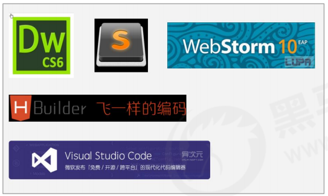
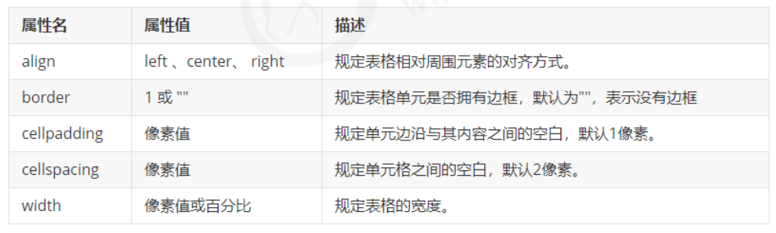
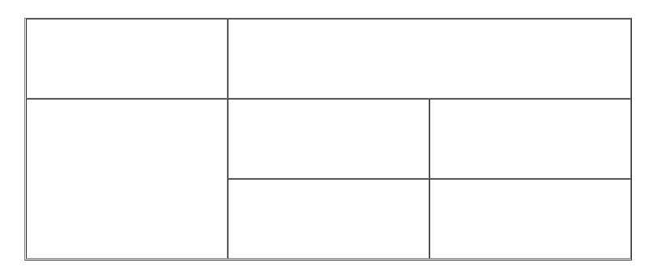
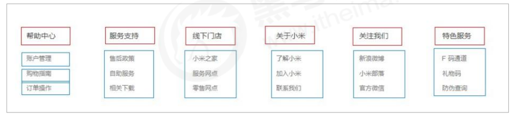
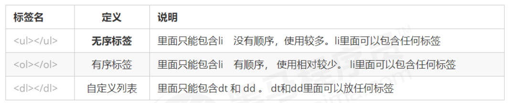
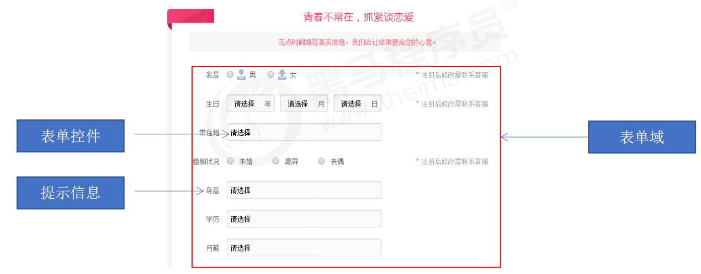
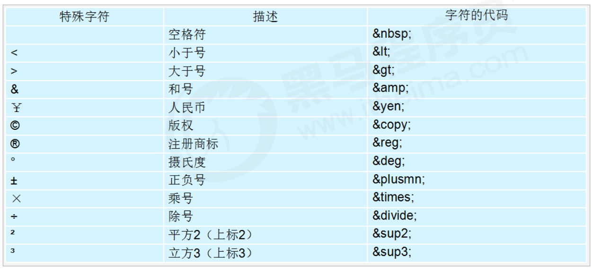

## 一、HTML简介

### 1. 网页

#### 1.1 初识网页

- 网站是指在因特网上根据一定的规则，使用 HTML 等制作的用于展示特定内容相关的网页集合。

- 网页是网站中的一“页”，通常是 HTML 格式的文件，它要通过浏览器来阅读。

- 网页是构成网站的基本元素，它通常由图片、链接、文字、声音、视频等元素组成。通常我们看到的网页，常见以 .htm 或 .html 后缀结尾的文件，因此将其俗称为 HTML 文件。

#### 1.2 初识HTML

- HTML指的是超文本标记语言(Hyper Text Markup Language)，它是用来描述网页的一种语言。

- HTML不是一种编程语言，而是一种标记语言(markup language)。

- 标记语言是一套标记标签(markup tag)。

- 所谓超文本，有两层含义：

  一是它可以加入图片、声音、动画、多媒体等内容（超越了文本限制）。

  二是它还可以从一个文件跳转到另一个文件，与世界各地主机的文件连接（超级链接文本）。

#### 1.3 网页形成

​	网页由网页元素组成，这些元素利用html标签描述出来，然后通过浏览器解析来显示给用户。

​	开发代码 -----> 浏览器显示代码（解析 渲染）-----> 生成最后的Web页面

### 2. 浏览器

#### 2.1 常用浏览器

​	浏览器是网页显示运行的平台。常用的浏览器有IE、火狐（Firefox）、谷歌（Chrome）、Safari 和Opera等，平时称为五大浏览器。

#### 2.2 浏览器内核	

​	浏览器内核（渲染引擎）：负责读取网页内容，整理讯息，计算网页的显示方式并显示界面。

| 浏览器         | 内核    | 备注                                              |
| -------------- | ------- | ------------------------------------------------- |
| IE             | Trident | IE、猎豹安全、360极速浏览器、百度浏览器           |
| Firefox        | Gecko   | 火狐浏览器内核                                    |
| Safari         | WebKit  | 苹果浏览器内核                                    |
| Chorme / Opera | Blink   | Chorme / Opera浏览器内核、Blink其实是WebKit的分支 |

​	目前国内一般浏览器都会采用 Webkit/Blink 内核，如 360、UC、QQ、搜狗等。

### 3. Web标准

Web 标准是由 W3C 组织和其他标准化组织制定的一系列标准的集合。W3C（万维网联盟）是国际最著名的标准化组织。

#### 3.1 需要Web标准的理由

遵循 Web 标准除了可以让不同的开发人员写出的页面更标准、更统一外，还有以下优点：	

- 让 Web 的发展前景更广阔。


- 内容能被更广泛的设备访问。
- 更容易被搜寻引擎搜索。
- 降低网站流量费用。
- 使网站更易于维护。
- 提高页面浏览速度。

#### 3.2 Web标准的构成

主要包括结构（Structure） 、表现（Presentation）和行为（Behavior）三个方面。

| 标准 | 说明                                                         |
| ---- | ------------------------------------------------------------ |
| 结构 | 结构用于对网页元素进行整理和分类，基础阶段主要学HTML         |
| 表现 | 表现用于设置网页元素的版式、颜色、大小等外观样式，主要指CSS  |
| 行为 | 行为是指网页模型的定义及交互的编写，基础阶段主要学Javascript |

Web 标准提出的最佳体验方案：结构、样式、行为相分离。 

简单理解： 结构写到 HTML 文件中， 表现写到 CSS 文件中， 行为写到 JavaScript 文件中。 

## 二、HTML标签

### 1. HTML语法规范

#### 1.1 **基本语法概述**

- HTML 标签是由尖括号包围的关键词，例如 <html>。

- HTML 标签通常是成对出现的，例如 <html> 和 </html> ，我们称为**双标签。**标签对中的第一个标签是开始标签，第二个标签是结束标签。

- 有些特殊的标签必须是单个标签（极少情况），例如 <br />我们称为**单标签。** 

#### 1.2 标签关系

双标签关系可以分为两类：包含关系和并列关系。

包含关系：\<head> \<title> \</title> \</head>

并列关系：\<head> \</head>\<body> \</body>

### 2. HTML基本结构标签

- 每个网页都会有一个基本的结构标签（也称为骨架标签），页面内容也是在这些基本标签上书写。HTML页面也称为 HTML 文档。

```html
<!DOCTYPE html>
<html lang="en">
<head>
    <meta charset="UTF-8">
    <meta name="viewport" content="width=device-width, initial-scale=1.0">
    <title>Document</title>
</head>
<body>
    
</body>
</html>
```

- 每个网页都会有一个基本的结构标签（也称为骨架标签），页面内容也是在这些基本标签上书写。

  | 标签名          | 定义     | 说明                                    |
  | --------------- | -------- | --------------------------------------- |
  | <html></html>   | HTML标签 | 页面中最大的标签，称为根标签            |
  | <head></head>   | 文档头部 | 注意在head标签中必须要设置的标签是title |
  | <title></title> | 文档标题 | 网页标题                                |
  | <body> </body>  | 文档主体 | 页面内容基本都是放在body里面            |

  

### 3. 开发工具



```html
<!DOCTYPE html>
<html lang="en">
<head>
    <meta charset="UTF-8">
    <meta name="viewport" content="width=device-width, initial-scale=1.0">
    <title>Document</title>
</head>
<body>
    
</body>
</html>
```


- ```html
  <!DOCTYPE html>标签 文档类型声明标签
  ```

   文档类型声明，作用就是告诉浏览器使用哪种HTML版本来显示网页。这句代码的意思是: 当前页面采取的是 HTML5 版本来显示网页。

  **注意:** 

  ~~~html
  <!DOCTYPE> 声明位于文档中的最前面的位置，处于 <html> 标签之前。
  <!DOCTYPE>不是一个 HTML 标签，它就是 文档类型声明标签
  ~~~

- lang语言种类

  用来定义当前文档显示的语言。en定义语言为英语。zh-CN定义语言为中文。

  简单来说,定义为en 就是英文网页, 定义为 zh-CN 就是中文网页

  其实对于文档显示来说，定义成en的文档也可以显示中文，定义成zh-CN的文档也可以显示英文。

  这个属性对浏览器和搜索引擎(百度.谷歌等)还是有作用的。

- 字符集

  字符集 (Character set)是多个字符的集合。以便计算机能够识别和存储各种文字。 

  在<head>标签内，可以通过<meta> 标签的 charset 属性来规定 HTML 文档应该使用哪种字符编码。

  charset 常用的值有：GB2312 、BIG5 、GBK 和 UTF-8，其中 UTF-8 也被称为万国码，基本包含了全世界所有国家需要用到的字符.

  **注意：**上面语法是必须要写的代码，否则可能引起乱码的情况。一般情况下，统一使用“UTF-8”编码，尽量统一写成标准的 "UTF-8"，不要写成 "utf8" 或 "UTF8"。

### 4. HTML常用标签

#### 4.1 标题标签\<h1>-\<h6>

HTML 提供了 6 个等级的网页标题， 即\<h1> - \<h6> 。

```
<h1> 我是一级标题 </h1>
```

单词 head 的缩写，意为头部、标题。

标签语义：作为标题使用，并且依据重要性递减。

**特点：**加了标题的文字会变的加粗，字号也会依次变大；

​			一个标题独占一行。

#### 4.2 段落和换行标签

- 段落标签

  在 HTML 标签中，<p>标签用于定义段落，它可以将整个网页分为若干个段落。

  ~~~html
  <p> 我是一个段落标签 </p>
  ~~~

​	单词 paragraph [ˈpærəgræf] 的缩写，意为段落。

​	标签语义：可以把 HTML 文档分割为若干段落。

​	**特点：**文本在一个段落中会根据浏览器窗口的大小自动换行。

​			 	段落和段落之间保有空隙。

- 换行标签

  在 HTML 中，一个段落中的文字会从左到右依次排列，直到浏览器窗口的右端，然后才自动换行。如果希望某段文本强制换行显示，就需要使用换行标签 \<br/>。

  ```html
  <br/>
  ```

  单词 break 的缩写，意为打断、换行。

  标签语义：强制换行。

  **特点：** 它是个单标签。

  标签只是简单地开始新的一行，跟段落不一样，段落之间会插入一些垂直的间距。

#### 4.3 文本格式化标签

在网页中，有时需要为文字设置**粗体**、*斜体* 或<u>下划线</u>等效果，这时就需要用到 HTML 中的文本格式化标签，使文字以特殊的方式显示。

标签语义: 突出重要性, 比普通文字更重要。

| 语义   | 标签                             | 说明                             |
| ------ | -------------------------------- | -------------------------------- |
| 加粗   | \<strong>\</strong>或者\<b>\</b> | 更推荐使用strong标签，语义更强烈 |
| 倾斜   | \<em>\</em>或者\<i>\</i>         | 更推荐使用em标签，语义更强烈     |
| 删除线 | \<del>\</del>或者\<s>\</s>       | 更推荐使用del标签，语义更强烈    |
| 下划线 | \<ins>\</ins>或者\<u>\</u>       | 更推荐使用ins标签，语义更强烈    |

#### 4.4 \<div> 和\<span>标签

\<div>和\<span>是没有语义的，他们就是一个盒子，用来装饰内容的。

```html
<div> 这是头部 </div> 
<span> 今日价格 </span>
```

div 是 division 的缩写，表示分割、分区。span 意为跨度、跨距。

**特点：**  \<div> 标签用来布局，但是现在一行只能放一个\<div> 大盒子。

\<span> 标签用来布局，一行上可以多个 \<span>小盒子。

#### 4.5 图像标签

在 HTML 标签中，\ 标签用于定义 HTML 页面中的图像。

```
 
```

单词 image 的缩写，意为图像。

src 是\标签的必须属性，它用于指定图像文件的路径和文件名。

所谓属性：简单理解就是属于这个图像标签的特性。

图像标签的其他属性：

| 属性   | 属性值   | 说明                                 |
| ------ | -------- | ------------------------------------ |
| src    | 图片路径 | 必须属性                             |
| alt    | 文本     | 替换文本，图像不能显示时的文字       |
| title  | 文本     | 提示文本，鼠标放到图像上，显示的文字 |
| width  | 像素     | 设置图像的宽度                       |
| height | 像素     | 设置图像的高度                       |
| border | 像素     | 设置图像的边框粗细                   |

- 图像标签注意要点：

  - 图像标签可以拥有多个属性，必须写在标签名的后面。
  - 属性之间不分先后顺序，标签名与属性、属性与属性之间均以空格分开。 
  - 属性采取键值对的格式，即 key=“value" 的格式，属性 =“属性值”。

- 路径

  - 实际工作中，我们的文件不能随便乱放，否则用起来很难快速的找到他们，因此我们需要一个文件夹来管理他们。

    **目录文件夹：**就是普通文件夹，里面只不过存放了我们做页面所需要的相关素材，比如 html 文件、图片等。

    **根目录：**打开目录文件夹的第一层就是根目录

  - 页面中的图片会非常多， 通常我们会新建一个文件夹来存放这些图像文件（images），这时再查找图像，就需要采用“路径”的方式来指定图像文件的位置。

    路径可以分为：相对路径   绝对路径 

  - **相对路径**：以引用文件所在位置为参考基础，而建立出的目录路径。简单来说，图片相对于 HTML 页面的位置。

    | 相对路径分类 | 符号 | 说明                                                        |
    | ------------ | ---- | ----------------------------------------------------------- |
    | 同一级路径   |      | 图像文件位于HTML文件同一级 如\        |
    | 下一级路径   | /    | 图像文件位于HTML文件下一级 如\ |
    | 上一级路径   | ../  | 图像文件位于HTML文件同一级 如\     |

    相对路径是从代码所在的这个文件出发，去寻找目标文件的，而我们这里所说的上一级 、下一级和同一级就是图片相对于 HTML 页面的位置。

  - **绝对路径**：是指目录下的绝对位置，直接到达目标位置，通常是从盘符开始的路径。

    例如，“D:\web\img\logo.gif”或完整的网络地址“http://www.itcast.cn/images/logo.gif”。

#### 4.6 超链接标签

- 链接的语法格式

  ```html
  <a href="跳转目标" target="目标窗口的弹出方式"> 文本或图像 </a>
  ```

  单词 anchor [ˈæŋkə(r)] 的缩写，意为：锚。

  两个属性的作用如下：

  href: 用于指定链接目标的url地址，（必须属性）当为标签应用href属性时，它就具有了超链接的功能。

  target: 用于指定链接页面的打开方式，其中_self为默认值，_blank为在新窗口打开方式。

- 链接分类

  1. 外部链接: 例如 < a href="http:// www.baidu.com "> 百度\</a >。

  2. 内部链接:网站内部页面之间的相互链接. 直接链接内部页面名称即可，例如 < a href="index.html"> 首页 \</a >。

  3. 空链接: 如果当时没有确定链接目标时，< a href="#"> 首页 \</a > 。

  4. 下载链接: 如果 href 里面地址是一个文件或者压缩包，会下载这个文件。

  5. 网页元素链接: 在网页中的各种网页元素，如文本、图像、表格、音频、视频等都可以添加超链接.

  6. 锚点链接: 点我们点击链接,可以快速定位到页面中的某个位置. 

     - 在链接文本的 href 属性中，设置属性值为 #名字 的形式，如\<a href="#two"> 第2集 \</a>

     - 找到目标位置标签，里面添加一个 id 属性 = 刚才的名字 ，如：\<h3 id="two">第2集介绍\</h3> 

       ```html
       <a href="#3live">个人生活</a><br />
       <h3 id="3live">个人生活具体内容</h3>
       ```

       

#### 4.7 表格标签

表格主要用于显示、展示数据，因为它可以让数据显示的非常的规整，可读性非常好。特别是后台展示数据的时候，能够熟练运用表格就显得很重要。一个清爽简约的表格能够把繁杂的数据表现得很有条理。

总结: 表格不是用来布局页面的,而是用来展示数据的。

- 表格基本语法：

```html
<table>
 <tr>
 <td>单元格内的文字</td>
 ...
 </tr>
 ...
</table>
```

​		\<table> \</table> 是用于定义表格的标签。

​		 \<tr> \</tr> 标签用于定义表格中的行，必须嵌套在 \<table> \</table>标签中。

​	\<td> \</td> 用于定义表格中的单元格，必须嵌套在\<tr>\</tr>标签中。

​		 字母 td 指表格数据（table data），即数据单元格的内容。

- 表头单元格标签

  一般表头单元格位于表格的第一行或第一列，表头单元格里面的文本内容加粗居中显示. 

  \<th> 标签表示 HTML 表格的表头部分(table head 的缩写)

  表头单元格也是单元格, 常用于表格第一行, 突出重要性, 表头单元格里面的文字会加粗居中显示.

```html
<table>
 <tr>
 <th>姓名</th>
 ...
 </tr>
 ...
</table>
```

- 表格属性

表格标签这部分属性实际开发不常用，后面通过 CSS 来设置.

目的有2个: 

   记住这些英语单词,后面 CSS 会使用.

   直观感受表格的外观形态.



- 表格结构标签

  ```html
    <table align="center" border="1" cellpadding="30" cellspacing="0">
          <thead>
              <tr>
                  <th>排名</th>
                  <th>关键词</th>
                  <th>趋势</th>
                  <th>进入搜索</th>
                  <th>最近七日</th>
                  <th>相关链接</th>
              </tr>
          </thead>
          <tbody>
              <tr>
                  <td>1</td>
                  <td>鬼吹灯</td>
                  <td></td>
                  <td>345</td>
                  <td>123</td>
                  <td><a href="#">贴吧</a>
                      <a href="#">图片</a>
                      <a href="#">百科</a>
                  </td>
              </tr>
          </tbody>
  ```

- 合并单元格

  - 合并单元格方式

    跨行合并：rowspan="合并单元格的个数"

    跨列合并：colspan="合并单元格的个数"

  - 目标单元格

    跨行：最上侧单元格为目标单元格，写合并代码

    跨列：最左侧单元格为目标单元格，写合并代码

  - 合并单元格的步骤

    首先，确定是跨行还是跨列合并

    之后，找到目标单元格，写上合并方式=合并的单元格数量。

    最后，删除多余单元格

    ```html
    <table align="right" border="1" cellspacing="0" width="500" height="200">
            <tr>
                <td></td>
                <td colspan="2"></td>
            </tr>
            <tr>
                <td rowspan="2"></td>
                <td></td>
                <td></td>
            </tr>
            <tr>
                <td></td>
                <td></td>
            </tr>
        </table>
    ```

    

#### 4.8 列表标签

​	表格是用来显示数据的，那么列表就是用来布局的。

​	列表最大的特点就是整齐、整洁、有序，它作为布局会更加自由和方便。

​	根据使用情景不同，列表可以分为三大类：无序列表、有序列表和自定义列表。

- 无序列表

  \<ul> 标签表示 HTML 页面中项目的无序列表，一般会以项目符号呈现列表项，而列表项使用\<li> 标签定义。

  无序列表的基本语法格式如下： 

  ```html
  <ul>
   <li>列表项1</li>
   <li>列表项2</li>
   <li>列表项3</li>
   ...
  </ul>
  ```

  - 无序列表的各个列表项之间没有顺序级别之分，是并列的。

    \<ul></ul> 中只能嵌套 <li></li>，直接在 <ul></ul> 标签中输入其他标签或者文字的做法是不被允许的。

  - <li> 与 </li> 之间相当于一个容器，可以容纳所有元素。

  - 无序列表会带有自己的样式属性，但在实际使用时，我们会使用 CSS 来设置。

- 有序列表

  有序列表即为有排列顺序的列表，其各个列表项会按照一定的顺序排列定义。 

  在 HTML 标签中，<ol> 标签用于定义有序列表，列表排序以数字来显示，并且使用 <li> 标签来定义列表项。

  有序列表的基本语法格式如下：

  ```html
  <ol>
   <li>列表项1</li>
   <li>列表项2</li>
   <li>列表项3</li>
   ...
  </ol>
  ```

  - ol中只能嵌套<li></li>，直接在<ol></ol>标签中输入其他标签或者文字的做法是不被允许的。


  - <li> 与 </li>之间相当于一个容器，可以容纳所有元素。

  - 有序列表会带有自己样式属性，但在实际使用时，我们会使用 CSS 来设置。

- 自定义列表

  自定义列表的使用场景:

  自定义列表常用于对术语或名词进行解释和描述，定义列表的列表项前没有任何项目符号。

  

  在 HTML 标签中，<dl> 标签用于定义描述列表（或定义列表），该标签会与 <dt>（定义项目/名字）和

  <dd>（描述每一个项目/名字）一起使用。

  其基本语法如下：

  ```html
  <dl>
   <dt>名词1</dt>
   <dd>名词1解释1</dd>
   <dd>名词1解释2</dd>
  </dl>
  ```

  - ```
    <dl></dl> 里面只能包含 <dt> 和 <dd>。
    ```

    

  - <dt> 和 <dd>个数没有限制，经常是一个<dt> 对应多个<dd>。

- 列表总结

  

#### 4.9 表单标签

- 表单的组成

  在 HTML 中，一个完整的表单通常由表单域、表单控件（也称为表单元素）和 提示信息3个部分构成。

  

  **表单域**是一个包含表单元素的区域。 

  在 HTML 标签中， 

  \<form> 标签用于定义表单域，以实现用户信息的收集和传递。

  \<form> 会把它范围内的表单元素信息提交给服务器。

  ```html
  <form action=“url地址” method=“提交方式” name=“表单域名称">
   各种表单元素控件
  </form>
  ```

  | 属性   | 属性值   | 作用                                               |
  | ------ | -------- | -------------------------------------------------- |
  | action | url地址  | 用于指定接受并处理表单数据的服务器程序的url地址    |
  | methon | get/post | 用于设置表单数据的提交方式，其取值为get或者post    |
  | name   | 名称     | 用于指定表单的名称，以区分同一个页面中的多个表单域 |

- 表单域

  这里需要记住两点:

  1. 在我们写表单元素之前,应该有个表单域把他们进行包含.

  2. 表单域是 form标签

- 表单控件（表单元素）

  在表单域中可以定义各种表单元素，这些表单元素就是允许用户在表单中输入或者选择的内容控件。

- \<input>输入表单元素

  在英文单词中，input 是输入的意思，而在表单元素中 \<input> 标签用于收集用户信息。 

  在 \<input> 标签中，包含一个 type 属性，根据不同的 type 属性值，输入字段拥有很多种形式（可以是文本字段、复选框、掩码后的文本控件、单选按钮、按钮等）。

  \<input /> 标签为单标签，type 属性设置不同的属性值用来指定不同的控件类型。

  type 属性的属性值及其描述如下：

  | 属性值   | 描述                                                         |
  | -------- | ------------------------------------------------------------ |
  | button   | 定义可点击按钮（多数情况下，用于通过JavaScript启动脚本）     |
  | checkbox | 定义复选框                                                   |
  | file     | 定义输入字段和“浏览”按钮，仅供文件上传                       |
  | hidden   | 定义隐藏的输入字段                                           |
  | image    | 定义图像形式的提交按钮                                       |
  | password | 定义密码字段，该字段中的字符被掩码                           |
  | radio    | 定义单选按钮                                                 |
  | reset    | 定义重置按钮，重置按钮会清除表单中的所有数据                 |
  | submit   | 定义提交按钮，提交按钮会把表单数据发送到服务器               |
  | text     | 定义单行的输入字段，用户可在其中输入文本，默认宽度为20个字符 |

  除 type 属性外，\<input>标签还有其他很多属性，其常用属性如下：

  | 属性      | 属性值       | 描述                              |
  | --------- | ------------ | --------------------------------- |
  | name      | 由用户自定义 | 定义input元素的名称               |
  | value     | 由用户自定义 | 规定input元素的值                 |
  | checked   | checked      | 规定input元素首次加载时应当被选中 |
  | maxlength | 正整数       | 规定输入字段中字符的最大长度      |

  1. name 和value 是每个表单元素都有的属性值,主要给后台人员使用.

  2. name 表单元素的名字, 要求 单选按钮和复选框要有相同的name值.

  3. checked属性主要针对于单选按钮和复选框, 主要作用一打开页面,就要可以默认选中某个表单元素.

  4. maxlength 是用户可以在表单元素输入的最大字符数, 一般较少使用.

  例子：

  ```html
  <form>
          <!-- text 文本框，用户可以输入任何文字 -->
          用户名：<input type="text" name="username"> <br>
          <!-- password 密码框，用户输入看不见的密码 -->
          密码：<input type="password" name="pwd"> <br>
          性别：男<input type='radio' name="sex" value="男" checked="checked">女<input type='radio' name="sex" value="女"> <br>
          爱好：吃饭<input type='checkbox' name="hobby" value="吃饭">睡觉<input type='checkbox' name="hobby" value="睡觉"> <br>
          <input type="submit" value="免费注册">
          <input type="reset" value="重新填写"> <br>
          <input type="button" value="获取短信验证码"> <br>
          上传头像：<input type="file">
      </form>
  ```

  

- \<select>下拉表单元素

- \<textarea> 文本域元素

### 5. HTML中的注释和特殊字符

- 注释

  HTML中的注释以“<!--”开头，以“ -->”结束。

- 特殊字符

  重点记住：空格 、大于号、 小于号 这三个， 其余的使用很少，如果需要回头查阅即可。

  

### 6. 查阅文档

推荐的网址：

 	百度: http://www.baidu.com

​	 W3C : http://www.w3school.com.cn/ 

 	MDN: https://developer.mozilla.org/zh-CN/

# 