# JS基础

## 1 初识JavaScript

### 1.1 JavaScript是什么？

- JavaScript 是世界上最流行的语言之一，是一种运行在客户端的脚本语言 （Script 是脚本的意思）
- 脚本语言：不需要编译，运行过程中由js解释器（js引擎）逐行来进行解释并执行
- 现在也可以基于Node.js技术进行服务器端编程

### 1.2 JavaScript的作用

- 表单动态校验（密码强度检测）（JS产生最初的目的）
- 网页特效
- 服务端开发(Node.js)
- 桌面程序(Electron)
- App(Cordova) 
- 控制硬件-物联网(Ruff)
- 游戏开发(cocos2d-js)

### 1.3 浏览器执行JS 简介

浏览器分成两部分：渲染引擎和 JS引擎

- 渲染引擎: 用来解析HTML与CSS，俗称内核，比如 chrome 浏览器的 blink ，老版本的 webkit
- JS引擎：也称为 JS 解释器。 用来读取网页中的JavaScript代码，对其处理后运行，比如 chrome 浏览器的 V8

浏览器本身并不会执行JS代码，而是通过内置 JavaScript 引擎(解释器) 来执行 JS 代码 。JS 引擎执行代码时逐行解释每一句源码（转换为机器语言），然后由计算机去执行，所以 JavaScript 语言归为脚本语言，会逐行解释执行。

### 1.4 JS的组成

JavaScript:

1. ECMAScript: JavaScript 语法
2. DOM：页面文档对象类型
3. BOM：浏览器对象类型

- **ECMAScript** 是由ECMA 国际（ 原欧洲计算机制造商协会）进行标准化的一门编程语言，这种语言在万维网上应用广泛，它往往被称为 JavaScript 或 JScript，但实际上后两者是 ECMAScript 语言的实现和扩展。

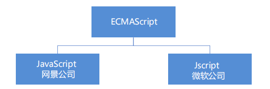

ECMAScript：ECMAScript 规定了JS的编程语法和基础核心知识，是所有浏览器厂商共同遵守的一套JS语法工业标准。

更多参看MDN: https://developer.mozilla.org/zh-CN/docs/Web/JavaScript/JavaScript_technologies_overview

- **DOM ——文档对象模型**

  **文档对象模型**（Document Object Model，简称DOM），是W3C组织推荐的处理可扩展标记语言的标准编程接口。通过DOM提供的接口可以对页面上的各种元素进行操作（大小、位置、颜色等）

- **BOM ——浏览器对象模型**

  **BOM** (Browser Object Model，简称BOM) 是指浏览器对象模型，它提供了独立于内容的、可以与浏览器窗口进行互动的对象结构。通过BOM可以操作浏览器窗口，比如弹出框、控制浏览器跳转、获取分辨率等。

### 1.5 JS书写位置

- 行内式JS

  ```html
  <input type="button" value="点我试试" onclick="alert('Hello World')" />
  ```

- 内嵌式

  ```html
  <script>
   alert('Hello World~!');
   </script>
  ```

- 外部JS文件

  ```html
  <script src="my.js"></script>  //中间不能再写东西
  ```

  

## 2 JavaScript注释

- 单行注释：（快捷键：ctrl+/）

  ```html
  // 我是一行文字，不想被 JS引擎 执行，所以 注释起来
  ```

- 多行注释：（快捷键：ctrl+shift+/）

  ```javascript
  /*
   获取用户年龄和姓名
   并通过提示框显示出来
  */
  ```

## 3 JavaScript输入输出语句

| 方法             | 说明                           | 归属   |
| ---------------- | ------------------------------ | ------ |
| alert(msg)       | 浏览器弹出警示框               | 浏览器 |
| console.log(msg) | 浏览器控制台打印输出信息       | 浏览器 |
| prompt(info)     | 浏览器弹出输入框，用户可以输入 | 浏览器 |

**注意：**alert() 主要用来显示消息给用户，console.log() 用来给程序员自己看运行时的消息。

## 4 变量

### 4.1 变量概述

定义：变量是用于存放数据的容器。我们通过变量名获取数据，甚至数据可以修改。

本质：变量是程序在内存中申请的一块用来存储数据的空间。

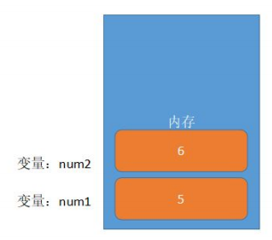

### 4.2 变量的使用

变量在使用时分为两步： 1. 声明变量 2. 赋值

```javascript
//声明变量
var age;
//赋值
age=10;
//变量的初始化
var age=19; //声名变量的同时赋值为18 
```


### 4.3 变量语法扩展

- 更新变量

  ```javascript
  var age = 18;
  age = 81; // 最后的结果就是81因为18 被覆盖掉了
  ```

- 同时声名多个变量

  ```javascript
  //同时声明多个变量时，只需要写一个var，多个变量名之间使用英文逗号隔开
  var age=10, name='zs', sex=2;
  ```

- 声明变量的特殊情况

  | 情况                       | 说明                   | 结果      |
  | -------------------------- | ---------------------- | --------- |
  | var age; consloe.log(age); | 只声明 不赋值          | undefined |
  | console.log(age)           | 只声明 不赋值 直接使用 | 报错      |
  | age=10; console.log(age);  | 不声明 只赋值          | 10        |

  

### 4.4 变量命名规范

- 由字母(A-Za-z)、数字(0-9)、下划线(_)、美元符号( $ )组成，如：usrAge, num01, _name

- 严格区分大小写。var app; 和 var App; 是两个变量

- 不能 以数字开头。 18age 是错误的

- 不能 是关键字、保留字。例如：var、for、while

-  变量名必须有意义。 MMD BBD nl → age 

- 遵守驼峰命名法。首字母小写，后面单词的首字母需要大写。 myFirstName

- 推荐翻译网站： 有道 爱词霸

## 5 数据类型

### 5.1 数据类型简介

- 在计算机中，不同的数据所需占用的存储空间是不同的，为了便于把数据分成所需内存大小不同的数据，充分利用存储空间，于是定义了不同的数据类型。

- 变量是用来存储值的所在处，它们有名字和数据类型。变量的数据类型决定了如何将代表这些值的位存储到计算机的内存中。

- **JavaScript 是一种弱类型或者说动态语言。**这意味着不用提前声明变量的类型，在程序运行过程中，类型会被自动确定。

  ```javascript
  var age = 10; // 这是一个数字型
  var areYouOk = '是的'; // 这是一个字符串
  ```

  在代码运行时，变量的数据类型是由JS引擎根据 =右边变量值的数据类型来判断的，运行完毕之后，变量就确定了数据类新。

  JavaScript拥有动态类型，同时也意味着相同的变量可用作不同的类型：

  ```javascript
  var x=6;     //x为数字
  var x="bill";   //x为字符串
  ```

- JS把数据类型分为两类：

  简单数据类型（Number,String, Boolean, Undefined, Null）

  复杂数据类型（Object）

### 5.2 简单数据类型

JavaScript 中的简单数据类型(基本数据类型)及其说明如下：

| 简单数据类型 | 说明                                            | 默认值    |
| ------------ | ----------------------------------------------- | --------- |
| Number       | 数字型，包含整型值和浮点型值，如21、0.21        | 0         |
| Boolean      | 布尔值类型，如true,false，等价1和0              | false     |
| String       | 字符串类型，如“讲讲” 注意：js里面字符串都带引号 | “”        |
| Undefined    | var a; 声名了变量a但是没有给值，此时a=undefined | undefined |
| Null         | var a=null; 声名了变量a为空值                   | null      |

#### 5.2.1 数字型Number

JavaScript 数字类型既可以用来保存整数值，也可以保存小数(浮点数）。 

```javascript
var age = 21; // 整数
var Age = 21.3747; // 小数
```

- 数字型进制：最常见的进制有二进制、八进制、十进制、十六进制

  ```javascript
  // 1.八进制数字序列范围：0~7
  // 在JS中八进制前面加0，十六进制前面加 0x
  var num1 = 07; // 对应十进制的7
  var num2 = 019; // 对应十进制的19
  var num3 = 08; // 对应十进制的8
   // 2.十六进制数字序列范围：0~9以及A~F
  var num = 0xA;
  ```

  

- 数字型范围：JavaScript中数值的最大和最小值

  ```javascript
  alert(Number.MAX_VALUE); // 1.7976931348623157e+308
  alert(Number.MIN_VALUE); // 5e-324
  ```

- 数字型三个特殊值

  ```javascript
  alert(Infinity); // Infinity
  alert(-Infinity); // -Infinity
  alert(NaN); // NaN
  ```

  Infinity,  代表无穷大，大于任何数值；

  -Infinity，代表无穷小，小于任何数值；

  NaN, Not a number，代表一个非数值；

- isNaN()：用来判断一个变量是否为非数字的类型，返回 true 或者 false

  ```javascript
  var usrAge = 21;
  var isNum = isNaN(userAge);
  console.log(isNum); // false ，21 不是一个非数字
  var usrName = "andy";
  console.log(isNaN(userName)); // true ，"andy"是一个非数字
  ```

#### 5.2.2 字符串型String

字符串型可以是引号中的任意文本，其语法为 双引号 "" 和 单引号''。

```javascript
var strMsg = "我爱北京天安门~"; // 使用双引号表示字符串
var strMsg2 = '我爱吃猪蹄~'; // 使用单引号表示字符串
// 常见错误
var strMsg3 = 我爱大肘子; // 报错，没使用引号，会被认为是js代码，但js没有这些语法
```

注：因为 HTML 标签里面的属性使用的是双引号，JS 这里我们更推荐使用单引号。

- 字符串引号嵌套

  JS可以用单引号嵌套双引号，或者用双引号嵌套单引号（外双内单，外单内双）

  ```javascript
  var strMsg = '我是"123"程序猿'; // 可以用''包含""
  var strMsg2 = "我是'123'程序猿"; // 也可以用"" 包含'' // 常见错误
  var badQuotes = 'What on earth?"; // 报错，不能 单双引号搭配
  ```

- 字符串转义符

  类似HTML里面的特殊字符，字符串中也有特殊字符，我们称之为转义符。转义符都是 \ 开头的，常用的转义符及其说明如下：

  | 转义符 | 解释说明                 |
  | ------ | ------------------------ |
  | \n     | 换行符, n是newline的意思 |
  | \\\    | 斜杠\                    |
  | \\'    | '  单引号                |
  | \\”    | “ 双引号                 |
  | \t     | tab缩进                  |
  | \b     | 空格，b是blank的意思     |

  

- 字符串长度

  字符串是由若干字符组成的，这些字符的数量就是字符串的长度。通过字符串的 length 属性可以获取整个字符串的长度。

  ```javascript
  var strMsg = "我是帅气多金的程序猿！";
  alert(strMsg.length); // 显示 11
  ```

- 字符串拼接

  多个字符串之间可以使用 + 进行拼接，其拼接方式为 字符串 + 任何类型 = 拼接之后的新字符串

  拼接前会把与字符串相加的任何类型转成字符串，再拼接成一个新的字符串。

  ```javascript
  //1.1 字符串 "相加" 
  alert('hello' + ' ' + 'world'); // hello world
  //1.2 数值字符串 "相加" 
  alert('100' + '100'); // 100100
  //1.3 数值字符串 + 数值
  alert('11' + 12); // 1112
  ```

  

- 字符串拼接加强

  ```javascript
  console.log('pink老师' + 18); // 只要有字符就会相连
  var age = 18;
  // console.log('pink老师age岁啦'); // 这样不行哦
  console.log('pink老师' + age); // pink老师18
  console.log('pink老师' + age + '岁啦'); // pink老师18岁啦
  ```

  - 我们经常会将字符串和变量来拼接，因为变量可以很方便地修改里面的值。
  - 变量是不能添加引号的，因为加引号的变量会变成字符串。
  - 如果变量两侧都有字符串拼接，口诀“引引加加 ”，删掉数字，变量写加中间。

#### 5.2.3  布尔型 Boolean

布尔类型有两个值：true 和 false ，其中 true 表示真（对），而 false 表示假（错）。

布尔型和数字型相加的时候， true 的值为 1 ，false 的值为 0。

```javascript
console.log(true + 1); // 2
console.log(false + 1); // 1
```

#### 5.2.4 Undefined 和 Null

一个声明后没有被赋值的变量会有一个默认值 undefined ( 如果进行相连或者相加时，注意结果）

```javascript
var variable;
console.log(variable); // undefined
console.log('你好' + variable); // 你好undefined
console.log(11 + variable); // NaN
console.log(true + variable); // NaN
```

一个声明变量给 null 值，里面存的值为空（学习对象时，我们继续研究null)

```javascript
var vari = null;
console.log('你好' + vari); // 你好null
console.log(11 + vari); // 11
console.log(true + vari); // 1
```


### 5.3 获取变量数据类型转换

- 获取检测变量的数据类型

  typeof 可用来获取检测变量的数据类型

  ```javascript
  var num = 18;
  console.log(typeof num) // 结果 number
  ```

  不同类型的返回值

  | 类型      | 例               | 结果        |
  | --------- | ---------------- | ----------- |
  | String    | typeof '小白'    | "string"    |
  | Number    | typeof 18        | "number"    |
  | Boolean   | typeof true      | "boolean"   |
  | Undefined | typeof undefined | "undefined" |
  | Null      | typeof null      | "object"    |

- 字面量

  字面量是在源代码中一个固定值的表示法，通俗来说，就是字面量表示如何表达这个值。

  - 数字字面量： 8，9，10
  - 字符串字面量：'黑马程序员', "大前端"
  - 布尔字面量: true,false 

### 5.4 数据类型转换

- 什么是数据类型转换

  使用表单、prompt 获取过来的数据默认是字符串类型的，此时就不能直接简单的进行加法运算，而需要转换变量的数据类型。通俗来说，就是把一种数据类型的变量转换成另外一种数据类型。

  通常会实现三种方式的转换：

  转换为字符串类型；转换为数字型；转换为布尔型

- 转换为字符串

  | 方式              | 说明                         | 案例                               |
  | ----------------- | ---------------------------- | ---------------------------------- |
  | toString()        | 转换成字符串                 | var num=1; alert(num.toString())   |
  | String() 强制转换 | 转换成字符串                 | var num=1; alert(String(num))      |
  | 加号拼接字符串    | 和字符串拼接的结果都是字符串 | var num=1; alert(num+"我是字符串") |

  - toString() 和 String() 使用方式不一样。
  - 三种转换方式，我们更喜欢用第三种加号拼接字符串转换方式， 这一种方式也称之为隐式转换。

- 转换为数字型（重点）

  | 方式                   | 说明                           | 案例                |
  | ---------------------- | ------------------------------ | ------------------- |
  | parselnt(string)函数   | 将string类型转换成整数数值类型 | parselnt('78')      |
  | parseFloat(string)函数 | 将string类型转换成浮点数值类型 | parseFloat('78.21') |
  | Number()强制转换函数   | 将string类型转换成为数值型     | Number('12')        |
  | js隐式转换(- * /)      | 利用算术运算隐式转换为数值型   | '12'-0              |

  注意：parselnt和parseFloat单词的大小写，这2个是重点；隐式转换是我们在进行算数运算的时候，JS自动转换率数据类型。

  ```javascript
  // 1. 弹出输入框，输入出生年份，并存储在变量中
  var year = prompt('请输入您的出生年份：'); // 用户输入
  // 2. 用今年减去刚才输入的年份 
  var result = 2019 - year; // 程序内部处理
  // 3. 弹出提示框 
  alert('您的年龄是:' + result + '岁'); // 输出结果
  ```

  ```javascript
  // 1. 先弹出第一个输入框，提示用户输入第一个值
   var num1 = prompt('请输入第一个值：');
  // 2. 再弹出第二个框，提示用户输入第二个值
  var num2 = prompt('请输入第二个值：');
  // 3. 将输入的值转换为数字型后，把这两个值相加，并将结果赋给新的变量 
  var result = parseFloat(num1) + parseFloat(num2);
  // 4. 弹出结果
  alert('结果是:' + result);
  ```

- 转换为布尔型

  | 方式          | 说明               | 案例            |
  | ------------- | ------------------ | --------------- |
  | Boolean()函数 | 其他类型转成布尔值 | Boolean('true') |

  - 代表空、否定的值会被转换为 false ，如 ''、0、NaN、null、undefined 

  - 其余值都会被转换为 true

    ```javascript
    console.log(Boolean('')); // false
    console.log(Boolean(0)); // false
    console.log(Boolean(NaN)); // false
    console.log(Boolean(null)); // false
    console.log(Boolean(undefined)); // false
    console.log(Boolean('小白')); // true
    console.log(Boolean(12)); // true
    ```

## 6 扩展

### 6.1 解释性语言和编译型语言

**概述**：计算机不能直接理解任何除机器语言以外的语言，所以必须要把程序员所写的程序语言翻译成机器语言才能执行。

 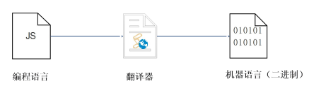

- 翻译器翻译的方式有两种：一种是编译，另一种是解释。两种方式之间的区别在于翻译的时间点不同
- 编译器是在代码执行之前进行编译，生成中间代码文件
- 解释器是在运行时进行及时解释，并立即执行（当编译器以解释方式运行的时候，也称之为解释器）

**执行过程**：

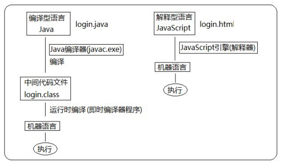

### 6.2 标识符、关键字、保留字

- 标识符：指开发人员为变量、属性、函数、参数取的名字。

  标识符不能是关键字或保留字。

- 关键字：是指JS本身已经使用了的字，不能再用它们充当变量名、方法名。

  包括：break、case、catch、continue、default、delete、do、else、finally、for、function、if、in、

  instanceof、new、return、switch、this、throw、try、typeof、var、void、while、with 等。

- 保留字：实际上就是预留的“关键字”，意思是现在虽然还不是关键字，但是未来可能会成为关键字，同样不能使用它们当变量名或者方法名。

  包括：boolean、byte、char、class、const、debugger、double、enum、export、extends、fimal、float、goto、implements、import、int、interface、long、mative、package、private、protected、public、short、static、super、synchronized、throws、transient、volatile 等。

  注：如果将保留字用作变量名或函数名，那么除非将来的浏览器实现了该保留字，否则很可能收不到任何错误消息。当浏览器将其实现后，该单词将被看做关键字，如此将出现关键字错误。

## 7 运算符

运算符（operator）也被称为操作符，是用于实现赋值、比较和执行算数运算等功能的符号。

JavaScript中常用的运算符有：

 算数运算符

 递增和递减运算符

 比较运算符

 逻辑运算符 

 赋值运算符

### 7.1 算数运算符

概念：算术运算使用的符号，用于执行两个变量或值的算术运算。

| 运算符 | 描述           | 实例 |
| ------ | -------------- | ---- |
| +      | 加             |      |
| -      | 减             |      |
| *      | 乘             |      |
| /      | 除             |      |
| %      | 取余数（取模） |      |

- 浮点数的精度问题

  浮点数值的最高精度是 17 位小数，但在进行算术计算时其精确度远远不如整数。

  ```javascript
  var result = 0.1 + 0.2; // 结果不是 0.3，而是：0.30000000000000004
  console.log(0.07 * 100); // 结果不是 7， 而是：7.000000000000001
  ```

  所以：**不要直接判断两个浮点数是否相等** ! 

- 表达式和返回值

  表达式：是由数字、运算符、变量等以能求得数值的有意义排列方法所得的组合

  简单理解：是由数字、运算符、变量等组成的式子

  表达式最终都会有一个结果，返回给我们，我们成为返回值

- 如何判断一个数能够被整除：它的余数是0 就说明这个数能被整除， 这就是 % 取余运算符的主要用途。

### 7.2 递增和递减运算符

如果需要反复给数字变量添加或减去1，可以使用**递增（++）和递减（** **-- ）**运算符来完成。 

在 JavaScript 中，递增（++）和递减（ -- ）既可以放在变量前面，也可以放在变量后面。放在变量前面时，我们可以称为前置递增（递减）运算符，放在变量后面时，我们可以称为后置递增（递减）运算符。

**注意：**递增和递减运算符必须和变量配合使用

- 前置递增运算符

  ++num 前置递增，就是自加1，类似于 num = num + 1，但是 ++num 写起来更简单。

  **先自加，后返回值。**

  ```javascript
  var num = 10;
  alert(++num + 10); //21
  ```

  

- 后置递增运算符

  num++ 后置递增，就是自加1，类似于 num = num + 1 ，但是 num++ 写起来更简单。

  **先返回原值，后自加。**

  ```javascript
  var num = 10;
  alert(10 + num++); // 20
  ```

- 小结

  - 前置递增和后置递增运算符可以简化代码的编写，让变量的值 + 1 比以前写法更简单

  - 单独使用时，运行结果相同

  - 与其他代码联用时，执行结果会不同

  - 后置：先原值运算，后自加（先人后己） 

  - 前置：先自加，后运算（先已后人） 

  -  开发时，大多使用后置递增/减，并且代码独占一行，例如：num++; 或者 num--;

### 7.3 比较运算符

概念：比较运算符（关系运算符）是两个数据进行比较时所使用的运算符，比较运算后，会返回一个布尔值（true / false）作为比较运算的结果。

| 运算符名称 | 说明                        | 案例      | 结果  |
| ---------- | --------------------------- | --------- | ----- |
| <          | 小于号                      | 1<2       | true  |
| >          | 大于号                      | 1>2       | false |
| >=         | 大于等于                    | 2>=2      | true  |
| <=         | 小于等于                    | 3<=2      | false |
| ==         | 判等号（会转型）            | 37==37    | true  |
| !=         | 不等号                      | 37!=37    | false |
| ===    !== | 全等 要求值和数据类型都一致 | 37==='37' | false |

- 等于号（=）小结

  | 符号 | 作用 | 用法                                       |
  | ---- | ---- | ------------------------------------------ |
  | =    | 赋值 | 把左边给右边                               |
  | ==   | 判断 | 判断两边的值是否相等（注意此时有隐式转换） |
  | ===  | 全等 | 判断两边的值和数据类型是否完全相同         |

  ```javascript
  console.log(18 == '18');  //true
  console.log(18 === '18');  //false
  ```

  

### 7.4 逻辑运算符

逻辑运算符概述

概念：逻辑运算符是用来进行布尔值运算的运算符，其返回值也是布尔值。后面开发中经常用于多个条件的判断。

| 逻辑运算符 | 说明 | 案例          |
| ---------- | ---- | ------------- |
| &&         | and  | true&&false   |
| \|\|       | or   | true\|\|false |
| !          | not  | !true         |

#### 7.4.1 逻辑与&&

两边都是 true才返回 true，否则返回 false.

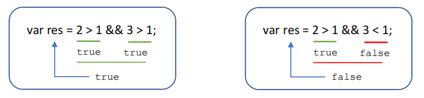

#### 7.4.2 逻辑或||

两边都为 false 才返回 false，否则都为true

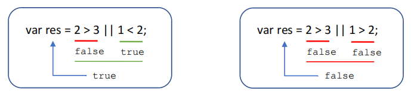

#### 6.4.3 逻辑非！

逻辑非（!）也叫作取反符，用来取一个布尔值相反的值，如 true 的相反值是 false。

```javascript
var isOk = !true;
console.log(isOk); // false
```


#### 6.4.4 短路运算（逻辑中断）

短路运算原理：当有多个表达式（值）时，左边的表达式值可以确定结果时，就不再继续运算右边的表达式的值；

- 逻辑与

  语法：表达式1&&表达式2

  如果第一个表达式的值为真，则返回表达式2 

  如果第一个表达式的值为假，则返回表达式1

  ```javascript
  console.log( 123 && 456 ); // 456
  console.log( 0 && 456 ); // 0
  console.log( 123 && 456&& 789 ); // 789
  ```

  

- 逻辑或

  语法：表达式1|| 表达式2

  如果第一个表达式的值为真，则返回表达式1

  如果第一个表达式的值为假，则返回表达式2

  ```javascript
  console.log( 123 || 456 ); // 123
  console.log( 0 || 456 ); // 456
  console.log( 123 || 456 || 789 ); // 123
  ```

  

### 7.5 赋值运算符

概念：用来把数据赋值给变量的运算符。

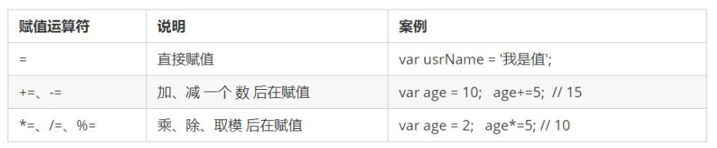

```javascript
var age = 10;
age += 5; // 相当于 age = age + 5;
age -= 5; // 相当于 age = age - 5;
age *= 10; // 相当于 age = age * 10;
```


### 7.6 运算符优先级

| 优先级 | 运算符     | 顺序            |
| ------ | ---------- | --------------- |
| 1      | 小括号     | （）            |
| 2      | 一元运算符 | ++ -- ！        |
| 3      | 算术运算符 | 先*/ % 后+-     |
| 4      | 关系运算符 | > >=  <  <=     |
| 5      | 相等运算符 | == !=  ===  !== |
| 6      | 逻辑运算符 | 先&&  后\|\|    |
| 7      | 赋值运算符 | =               |
| 8      | 逗号运算符 | ,               |

- 一元运算符里面的逻辑非优先级很高
- 逻辑与比逻辑或优先级高

## 8 流程控制

在一个程序执行的过程中，各条代码的执行顺序对程序的结果是有直接影响的。很多时候我们要通过控制代码的执行顺序来实现我们要完成的功能。

简单理解： 流程控制就是来控制我们的代码按照什么结构顺序来执行。

流程控制主要有三种结构，分别是顺序结构、分支结构和循环结构，这三种结构代表三种代码执行的顺序。

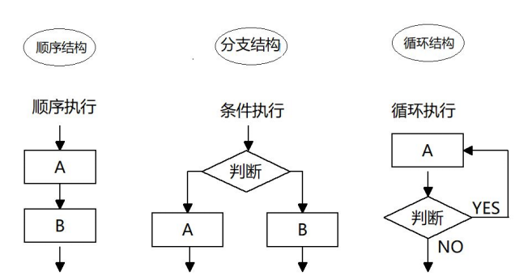


### 8.1 分支流程控制if语句

由上到下执行代码的过程中，根据不同的条件，执行不同的路径代码（执行代码多选一的过程），从而得到不同的结果

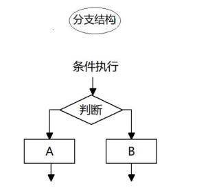

JS语言提供了两种分支结构语句：if语句；switch语句；

- if语句

  ```javascript
  // 条件成立执行代码，否则什么也不做
  if (条件表达式) {
   // 条件成立执行的代码语句
  }
  ```

- if else语句（双分支语句）

  ```javascript
  // 条件成立 执行 if 里面代码，否则执行else 里面的代码
  if (条件表达式) {
   // [如果] 条件成立执行的代码
  } else {
   // [否则] 执行的代码
  }
  ```

- if else if语句（多分支语句）

  ```javascript
  // 适合于检查多重条件。
  if (条件表达式1) {
   语句1；
  } else if (条件表达式2) {
   语句2；
  } else if (条件表达式3) {
   语句3；
   ....
  } else {
   // 上述条件都不成立执行此处代码
  }
  ```

  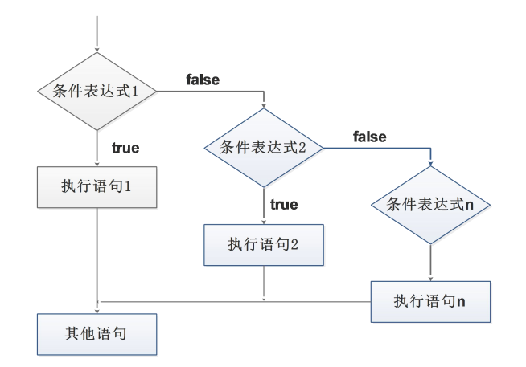


### 8.2 三元表达式

三元表达式也能做一些简单的条件选择。 有三元运算符组成的式子称为三元表达式。

```javascript
表达式1？ 表达式2：表达式3；
//如果表达式1为 true ，则返回表达式2的值，如果表达式1为 false，则返回表达式3的值
```

### 8.3 分支流程控制switch语句

switch 语句也是多分支语句，它用于基于不同的条件来执行不同的代码。当要针对变量设置一系列的特定值的选项时，就可以使用 switch。

```javascript
switch( 表达式 ){ 
 case value1:
 // 表达式 等于 value1 时要执行的代码
 break;
 case value2:
 // 表达式 等于 value2 时要执行的代码
 break;
 default:
 // 表达式 不等于任何一个 value 时要执行的代码
}
```

 switch ：开关 转换 ， case ：小例子 选项；

 关键字 switch 后面括号内可以是表达式或值， 通常是一个变量；

 关键字 case , 后跟一个选项的表达式或值，后面跟一个冒号；

 switch 表达式的值会与结构中的 case 的值做比较；

 如果存在匹配全等(===) ，则与该 case 关联的代码块会被执行，并在遇到 break 时停止，整个 switch 语句代码执行结束；

 如果所有的 case 的值都和表达式的值不匹配，则执行 default 里的代码；

**注意：** 执行case 里面的语句时，如果没有break，则继续执行下一个case里面的语句。

- switch 语句和 if else if 语句的区别

  ① 一般情况下，它们两个语句可以相互替换

  ② switch...case 语句通常处理 case为比较确定值的情况， 而 if…else…语句更加灵活，常用于范围判断(大于、等于某个范围) 

  ③ switch 语句进行条件判断后直接执行到程序的条件语句，效率更高。而if…else 语句有几种条件，就得判断多少次。

  ④ 当分支比较少时，if… else语句的执行效率比 switch语句高。 

  ⑤ 当分支比较多时，switch语句的执行效率比较高，而且结构更清晰。

## 9 循环

在实际问题中，有许多具有规律性的重复操作，因此在程序中要完成这类操作就需要重复执行某些语句。

JS中的循环主要有三种类型的循环语句：

for循环、while循环、do...while循环

### 9.1 for循环

```javascript
for(初始化变量; 条件表达式; 操作表达式 ){
    //循环体
}

```

#### 9.1.1断点调试

断点调试是指自己在程序的某一行设置一个断点，调试时，程序运行到这一行就会停住，然后你可以一步一步往下调试，调试过程中可以看各个变量当前的值，出错的话，调试到出错的代码行即显示错误，停下。

断点调试可以帮我们观察程序的运行过程。

- 浏览器中按 F12--> sources -->找到需要调试的文件-->在程序的某一行设置断点
- Watch: 监视，通过watch可以监视变量的值的变化，非常的常用。
- F11: 程序单步执行，让程序一行一行的执行，这个时候，观察watch中变量的值的变化。
- 代码调试的能力非常重要，只有学会了代码调试，才能学会自己解决bug的能力。初学者不要觉得调试代码麻烦就不去调试，知识点花点功夫肯定学的会，但是代码调试这个东西，自己不去练，永远都学不会。
- 今天学的代码调试非常的简单，只要求同学们记住代码调试的这几个按钮的作用即可，后面还会学到很多的代码调试技巧。

### 9.2 双重for循环

```JavaScript
for (外循环的初始; 外循环的条件; 外循环的操作表达式) {
    for (内循环的初始; 内循环的条件; 内循环的操作表达式) {  
       需执行的代码;
   }
}

```


### 9.3 while循环

```JavaScript
while (条件表达式) {
    // 循环体代码 
}

```

- 执行思路：

  先执行条件表达式，如果结果为 true，则执行循环体代码；如果为 false，则退出循环，执行后面代码；

  执行循环体代码；

  循环体代码执行完毕后，程序会继续判断执行条件表达式，如条件仍为true，则会继续执行循环体，直到循环条件为 false 时，整个循环过程才会结束；

### 9.4 do while循环

do... while 语句其实是 while 语句的一个变体。该循环会先执行一次代码块，然后对条件表达式进行判断，如果条件为真，就会重复执行循环体，否则退出循环。
do... while 语句的语法结构如下：

```javascript
do {
    // 循环体代码 - 条件表达式为 true 时重复执行循环体代码
} while(条件表达式);

```

注意：先再执行循环体，再判断，我们会发现 do…while 循环语句至少会执行一次循环体代码。

### 9.5 循环小结

- JS 中循环有 for 、while 、 do while 
- 三个循环很多情况下都可以相互替代使用
- 如果是用来计次数，跟数字相关的，三者使用基本相同，但是我们更喜欢用 for
- while 和 do…while 可以做更复杂的判断条件，比 for 循环灵活一些 
- while 和 do…while 执行顺序不一样，while 先判断后执行，do…while 先执行一次，再判断执行
- while 和 do…while 执行次数不一样，do…while 至少会执行一次循环体， 而 while 可能一次也不执行
- 实际工作中，我们更常用for 循环语句，它写法更简洁直观， 所以这个要重点学习

### 9.6 continue break

- continue 关键字：用于立即跳出本次循环，继续下一次循环（本次循环体中 continue 之后的代码就会少执行一次）。

  例如，吃5个包子，第3个有虫子，就扔掉第3个，继续吃第4个第5个包子，其代码实现如下：

  ```javascript
  for (var i = 1; i <= 5; i++) {     if (i == 3) {         console.log('这个包子有虫子，扔掉');         continue; // 跳出本次循环，跳出的是第3次循环       }      console.log('我正在吃第' + i + '个包子呢'); }
  ```

- break关键字：用于立即跳出整个循环（循环结束）。
  例如，吃5个包子，吃到第3个发现里面有半个虫子，其余的不吃了，其代码实现如下：

  ```javascript
  for (var i = 1; i <= 5; i++) {
     if (i == 3) {
         break; // 直接退出整个for 循环，跳到整个for下面的语句
     }
     console.log('我正在吃第' + i + '个包子呢');
   }
  
  ```

## 10 JavaScript 命名规范以及语法格式

- 标识符命名规范

   变量、函数的命名必须要有意义；
   变量的名称一般用名词；  
   函数的名称一般用动词 ；

- 操作符规范

  ```javascript
  // 操作符的左右两侧各保留一个空格
  for (var i = 1; i <= 5; i++) {
     if (i == 3) {
         break; // 直接退出整个 for 循环，跳到整个for循环下面的语句
     }
     console.log('我正在吃第' + i + '个包子呢');
  }
  
  ```

  

- 单行注释规范

  ```javascript
  for (var i = 1; i <= 5; i++) {
     if (i == 3) {
         break; // 单行注释前面注意有个空格
     }
     console.log('我正在吃第' + i + '个包子呢');
  }
  
  ```

## 11 数组

### 11.1 数组概念

数组是指一组数据的集合，其中的每个数据被称作元素，在数组中可以存放任意类型的元素。数组是一种将一组数据存储在单个变量名下的优雅方式。

```javascript
// 普通变量一次只能存储一个值
var  num = 10; 
// 数组一次可以存储多个值
var arr = [1,2,3,4,5];

```

### 11.2 创建数组

创建数组的方式：

1. 利用new创建数组

2.  利用数组字面量创建数组

- 利用new创建数组

  ```JavaScript
  var 数组名 = new Array() ；
  var arr = new Array();   // 创建一个新的空数组
  
  ```

- 利用数组字面量创建数组 

  ```JavaScript
  //1. 使用数组字面量方式创建空的数组
  var  数组名 = []；
  //2. 使用数组字面量方式创建带初始值的数组
  var  数组名 = ['小白','小黑','大黄','瑞奇'];
  
  ```

  - 数组的字面量是方括号[]
  - 声名数组并赋值为数组的初始化
  - 这种字面量方式也是之后最多使用的方式

- 数组元素的类型

  数组中可以存放任意类型的数据，例如字符串，数字，布尔值等。

  ```JavaScript
  var arrStus = ['小白',12,true,28.9];
  
  ```

  

### 11.3 获取数组中的元素

数组的索引。

索引 (下标) ：用来访问数组元素的序号（数组下标从 0 开始）。

数组可以通过索引来访问、设置、修改对应的数组元素，我们可以通过“数组名[索引]”的形式来获取数组中的元素。
这里的访问就是获取得到的意思。

```JavaScript
// 定义数组
var arrStus = [1,2,3];
// 获取数组中的第2个元素
alert(arrStus[1]);    
```


### 11.4 遍历数组

```JavaScript
var arr = ['red','green', 'blue'];
console.log(arr[0]) // red
console.log(arr[1]) // green
console.log(arr[2]) // blue

```

```JavaScript
//遍历: 就是把数组中的每个元素从头到尾都访问一次（类似我们每天早上学生的点名）。
//我们可以通过 for 循环索引遍历数组中的每一项

var arr = ['red','green', 'blue'];
for(var i = 0; i < arr.length; i++){
    console.log(arrStus[i]);
}

```

- 数组长度

  使用“数组名.length”可以访问数组元素的数量（数组长度）。 

  ```javascript
  var arrStus = [1,2,3];
  alert(arrStus.length);  // 3
  
  ```

  注意： 此处数组的长度是数组元素的个数 ，不要和数组的索引号混淆。
  当我们数组里面的元素个数发生了变化，这个 length 属性跟着一起变化。

### 11.5 数组中新增元素

#### 11.5.1通过修改length长度新增数组元素

- 可以通过修改 length 长度来实现数组扩容的目的

- length 属性是可读写的

  ```JavaScript
  var arr = ['red', 'green', 'blue', 'pink'];
  arr.length = 7;
  console.log(arr);
  console.log(arr[4]);
  console.log(arr[5]);
  console.log(arr[6]);
  
  ```

  其中索引号是 4，5，6 的空间没有给值，就是声明变量未给值，默认值就是 undefined。

  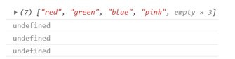

#### 11.5.2 通过修改数组索引新增数组元素

-  可以通过修改数组索引的方式追加数组元素

-  不能直接给数组名赋值，否则会覆盖掉以前的数据

  ```JavaScript
  var arr = ['red', 'green', 'blue', 'pink'];
  arr[4] = 'hotpink';
  console.log(arr);
  arr='有点意思';  
  console.log(arr); //不要直接给数组名赋值，否则里面的数组元素都没有了
  ```

  

## 12 函数

### 12.1 函数的概念

在 JS 里面，可能会定义非常多的相同代码或者功能相似的代码，这些代码可能需要大量重复使用。
虽然 for循环语句也能实现一些简单的重复操作，但是比较具有局限性，此时我们就可以使用 JS 中的函数。
函数：就是封装了一段可被重复调用执行的代码块。通过此代码块可以实现大量代码的重复使用。  

### 12.2 函数的使用

- 声明函数

  ```javascript
  // 声明函数
  function 函数名() {
      //函数体代码
  }
  
  ```

  function是声名函数的关键字，必须小写；

  由于函数一般是为了实现某个功能才定义的，所以通常我们将函数命名为动词，比如getSum。

- 调用函数

  ```javascript
  //调用函数
  函数名(); //通过调用函数名来执行函数体代码
  
  ```

  注意：声明函数本身并不会执行代码，只有调用函数时才会执行函数体代码。

- 函数的封装

  函数的封装是把一个或者多个功能通过函数的方式封装起来，对外只提供一个简单的函数接口。
  简单理解：封装类似于将电脑配件整合组装到机箱中 ( 类似快递打包）  

### 12.3 函数的参数

- 形参和实参

  在声明函数时，可以在函数名称后面的小括号中添加一些参数，这些参数被称为形参，而在调用该函数时，同样也需要传递相应的参数，这些参数被称为实参。

  参数的作用 : 在函数内部某些值不能固定，我们可以通过参数在调用函数时传递不同的值进去。

  ```JavaScript
  // 带参数的函数声明
  function 函数名(形参1, 形参2 , 形参3...) { // 可以定义任意多的参数，用逗号分隔
    // 函数体
  }
  // 带参数的函数调用
  函数名(实参1, 实参2, 实参3...); 
  
  ```

  

- 函数参数的传递过程

  ```javascript
  // 声明函数
  function getSum(num1, num2) {
      console.log(num1 + num2);
  }
  // 调用函数
  getSum(1, 3); // 4
  getSum(6, 5); // 11
  // 1. 调用的时候实参值是传递给形参的
  // 2. 形参简单理解为：不用声明的变量
  // 3. 实参和形参的多个参数之间用逗号（,）分隔
  
  ```

  

- 函数形参和实参个数不匹配问题

  | 参数个数             | 说明                               |
  | -------------------- | ---------------------------------- |
  | 实参个数等于形参个数 | 输出正确结果                       |
  | 实参个数多余形参个数 | 只能取到形参的个数                 |
  | 实参个数小于形参个数 | 多的形参定义为undefined，结果为NaN |

  ```javascript
  function sum(num1, num2) {
      console.log(num1 + num2);
  }
  sum(100, 200);             // 形参和实参个数相等，输出正确结果
  sum(100, 400, 500, 700);   // 实参个数多于形参，只取到形参的个数
  sum(200);                  // 实参个数少于形参，多的形参定义为undefined，结果为NaN
  
  ```

  注意：在JavaScript中，形参的默认值是undefined。

- 小结

  -  函数可以带参数也可以不带参数
  -  声明函数的时候，函数名括号里面的是形参，形参的默认值为 undefined
  -  调用函数的时候，函数名括号里面的是实参
  -  多个参数中间用逗号分隔
  -  形参的个数可以和实参个数不匹配，但是结果不可预计，我们尽量要匹配


### 12.4 函数的返回值

#### 12.4.1 return语句

有的时候，我们会希望函数将值返回给调用者，此时通过使用 return 语句就可以实现。
return 语句的语法格式如下：

```JavaScript
// 声明函数
function 函数名（）{
    ...
    return  需要返回的值；
}
// 调用函数
函数名();    // 此时调用函数就可以得到函数体内return 后面的值

```

- 在使用 return 语句时，函数会停止执行，并返回指定的值
-  如果函数没有 return ，返回的值是 undefined

有的时候，我们会希望函数将值返回给调用者，此时通过使用 return 语句就可以实现。
例如，声明了一个sum()函数，该函数的返回值为666，其代码如下：

```javascript
// 声明函数
function sum（）{
    ...
    return  666；
}
// 调用函数
sum();      // 此时 sum 的值就等于666，因为 return 语句会把自身后面的值返回给调用者 

```


#### 12.4.2 return终止函数

return语句之后的代码不被执行：

```javascript
function add(num1，num2){
    //函数体
    return num1 + num2; // 注意：return 后的代码不执行
    alert('我不会被执行，因为前面有 return');
}
var resNum = add(21,6); // 调用函数，传入两个实参，并通过 resNum 接收函数返回值
alert(resNum);          // 27

```


#### 12.4.3 return 的返回值

return 只能返回一个值。如果用逗号隔开多个值，以最后一个为准。

```javascript
function add(num1，num2){
    //函数体
    return num1，num2;
}
var resNum = add(21,6); // 调用函数，传入两个实参，并通过 resNum 接收函数返回值
alert(resNum);          // 6

```


#### 12.4.4 函数没有return返回undefined

函数都是有返回值的

- 如果有return ，则返回 return 后面的值
- 如果没有return， 则返回 undefined 


#### 12.4.5 break ,continue ,return 的区别

- break ：结束当前的循环体（如 for、while）
- continue ：跳出本次循环，继续执行下次循环（如 for、while）
- return ：不仅可以退出循环，还能够返回 return 语句中的值，同时还可以结束当前的函数体内的代码

### 12.5 arguments的使用

当我们不确定有多少个参数传递的时候，可以用 arguments 来获取。在 JavaScript 中，arguments 实际上它是当前函数的一个内置对象。所有函数都内置了一个 arguments 对象，arguments 对象中存储了传递的所有实参。

arguments展示形式是一个伪数组（并不是真正意义上的数组），因此可以进行遍历。伪数组具有以下特点：

- 具有length属性
- 按索引方式储存数据
- 不具有数组的push,pop等方法

```javascript
function maxValue() {
      var max = arguments[0];
      for (var i = 0; i < arguments.length; i++) {
         if (max < arguments[i]) {
                    max = arguments[i];
         }
      }
      return max;
}
 console.log(maxValue(2, 4, 5, 9));
 console.log(maxValue(12, 4, 9));

```


### 12.6 函数的两种声名方式

- 自定义函数方式（命名函数）

  利用函数关键字function自定义函数的方式

  ```javascript
  // 声明定义方式
  function fn() {...}
  // 调用  
  fn();  
  // 因为有名字，所以也被称为命名函数
  // 调用函数的代码既可以放到声明函数的前面，也可以放在声明函数的后面
  
  ```

- 函数表达式方式（匿名函数）

  ```javascript
  // 这是函数表达式写法，匿名函数后面跟分号结束
  var fn = function(){...}；
  // 调用的方式，函数调用必须写到函数体下面
  fn();
  
  ```

  - 因为函数没有名字，所以也被称为匿名函数
  - 这个fn里面存储的是一个函数
  - 函数表达式方式原理跟声名变量的方式是一致的
  - 函数调用的代码必须写道函数体后面

## 13 作用域

### 13.1 作用域概述

通常来说，一段程序代码中所用到的名字并不总是有效和可用的，而限定这个名字的可用性的代码范围就是这个名字的作用域。作用域的使用提高了程序逻辑的局部性，增强了程序的可靠性，减少了名字冲突。

JavaScript（es6前）中的作用域有两种：

全局作用域；局部作用域（函数作用域）；

- 全区作用域：作用于所有代码执行的环境(整个 script 标签内部)或者一个独立的 js 文件。
- 局部作用域 （函数作用域）：作用于函数内的代码环境，就是局部作用域。 因为跟函数有关系，所以也称为函数作用域。

JS没有块级作用域

- 块作用域由 { } 包括。

- 在其他编程语言中（如 java、c#等），在 if 语句、循环语句中创建的变量，仅仅只能在本 if 语句、本循环语句中使用，如下面的Java代码：

  ```java
  if(true){
    int num = 123;
    system.out.print(num);  // 123
  }
  system.out.print(num);    // 报错
  
  ```


- JS没有款及作用域（在ES6之前）

  ```javascript
  if(true){
    var num = 123;
    console.log(123); //123
  }
  console.log(123);   //123
  
  ```

  

### 13.2 变量的作用域

在JavaScript中，根据作用域的不同，变量可以分为两种：
全局变量；局部变量；

- 全局变量：在任何一个地方都可以使用，只有在浏览器关闭时才会被销毁，因此比较占内存
- 局部变量：只在函数内部使用，当期所在的代码块被执行时，会被初始化；当代码块运行结束后，就会被销毁，因此更节省内存空间。

在全局作用域下声明的变量叫做全局变量（在函数外部定义的变量）。

- 全局变量在代码的任何位置都可以使用

- 在全局作用域下var声名的变量是全局变量

- 特殊情况下，在函数内不使用var声名的变量也是全局变量（不建议使用）

  ```JavaScript
  function fun(){
  	var num1=10; //局部变量，只能在函数内部使用
  	num2=20; //全局变量
  }
  fun();
  console.log(num1);  //报错，num1没有被定义过
  console.log(num2);  // 20
  ```

  

在局部作用域下声明的变量叫做局部变量（在函数内部定义的变量）

- 局部变量只能在该函数内部使用
- 在函数内部var声名的变量是局部变量
- 函数的形参实际上就是局部变量

### 13.3 作用域链

- 只要是代码，就至少有一个作用域

- 写在函数内部的局部作用域

- 如果函数中还有函数，那么在这个作用域中就又可以诞生一个作用域

- 根据在内部函数可以访问外部函数变量的这种机制，用链式查找决定哪些数据能被内部函数访问，就称作作用域链。

  ```javascript
  var num = 10;
  function f1() {  // 外部函数
      var num = 20;
      function f2() {  //内部函数
          console.log( num );  
      }
      f2();
  }
  f1();  //输出的值是20
  
  ```

作用域链：采用就近原则的方式来查找变量最终的值。

## 14 预解析

JavaScript 代码是由浏览器中的 JavaScript 解析器来执行的。JavaScript 解析器在运行 JavaScript 代码的时候分为两步：预解析和代码执行。

- 预解析：在当前作用域下，JS代码执行之前，浏览器会默认把带有var和function声名的变量在内存中进行提前声名或者定义。
- 代码执行： 从上到下执行JS语句。

预解析只会发生在通过var定义的变量和function上。学习预解析能够让我们知道为什么在变量声名之前访问变量的值是undefined，为什么在函数声名之前就可以调用函数。

### 14.1 变量预解析和函数预解析

- 变量预解析（变量提升）

  预解析也叫做变量、函数提升。
  变量提升： 变量的声明会被提升到当前作用域的最上面，变量的赋值不会提升。

  ```JavaScript
  console.log(num);  // 结果是多少？
  var num = 10;      // undefined
  // 相当于执行了以下代码：
  var num;
  console.log(num);
  num=10;
  ```

- 函数预解析（函数提升）

  函数提升： 函数的声明会被提升到当前作用域的最上面，但是不会调用函数。

  ```JavaScript
  fn();
  function fn() {
      console.log('打印');  // 可以执行
  }
  
  ```

  ```JavaScript
  fun();   //执行报错
  var fun=function(){
  console.log(22);
  }
  // 相当于执行了以下代码：
  var fun;
  fun();  // 没有这个函数，所以会报错
  fun=function(){
  console.log(22);
  }
  
  ```

### 14.2 预解析案例

```JavaScript
// 案例1
var num = 10;
fun();
function fun() {
  console.log(num);
  var num = 20;
}
// 输出结果：undefined
```


```javascript
// 案例2
var num = 10;
function fn(){
    console.log(num);    // undefined
    var num = 20;
    console.log(num);    // 20
} 
fn();

```


```javascript
// 案例3
var a = 18;
f1();
function f1() {
  var b = 9;
  console.log(a);    // undefined
  console.log(b);    // 9
  var a = '123';
}

```

 

```javascript
// 案例4
f1();
console.log(c);
console.log(b);
console.log(a);
function f1() {
  var a = b = c = 9;
  console.log(a);   
  console.log(b);      
  console.log(c);   
}
// 相当于以下代码
function f1() {
  
    // var a=9; b=9; c=9   b和c直接赋值，没有var声名，当全局变量看
  var a;
  a=b=c=9;
  console.log(a);   // 9
  console.log(b);   // 9   
  console.log(c);   // 9
}
f1();
console.log(c);   // 9
console.log(b);   // 9
console.log(a);   //报错 
```


## 15 对象

### 15.1 对象的概念

在 JavaScript 中，对象是一组无序的相关属性和方法的集合，所有的事物都是对象，例如字符串、数值、数组、函数等。
对象是由属性和方法组成的。
 属性：事物的特征，在对象中用属性来表示（常用名词）
 方法：事物的行为，在对象中用方法来表示（常用动词）

保存一个值时，可以使用变量，保存多个值（一组值）时，可以使用数组。如果要保存一个人的完整信息呢？
例如，将“张三疯”的个人的信息保存在数组中的方式为：

```JavaScript
var arr = [‘张三疯’, ‘男', 128,154];

```


### 15.2 创建对象的三种方式

在 JavaScript 中，现阶段我们可以采用三种方式创建对象（object）：

利用字面量创建对象 ；
利用 new Object 创建对象 ；
利用构造函数创建对象 ；

#### 15.2.1 利用字面量创建对象

对象字面量：就是花括号 { } 里面包含了表达这个具体事物（对象）的属性和方法。
{ } 里面采取键值对的形式表示 

- 键：相当于属性名

- 值：相当于属性值，可以是任意类型的值（数字类型、字符串类型、布尔类型，函数类型等）

  ```javascript
  var star={
  name : 'pink',
      age : 18,
      sex : '男',
      sayHi : function(){
          alert('大家好啊~');
      }
  
  }
  ```

对象的调用

- 对象里面的属性调用 : 对象.属性名 ，这个小点 . 就理解为“ 的 ”

- 对象里面属性的另一种调用方式 : 对象[‘属性名’]，注意方括号里面的属性必须加引号，我们后面会用 

- 对象里面的方法调用：对象.方法名() ，注意这个方法名字后面一定加括号 

  ```javascript
  console.log(star.name)     // 调用名字属性
  console.log(star['name'])  // 调用名字属性
  star.sayHi();              // 调用 sayHi 方法,注意，一定不要忘记带后面的括号
  
  
  ```

变量、属性、函数、方法总结

- 变量：单独声明赋值，单独存在
- 属性：对象里面的变量称为属性，不需要声明，用来描述该对象的特征
- 函数：单独存在的，通过“函数名()”的方式就可以调用
- 方法：对象里面的函数称为方法，方法不需要声明，使用“对象.方法名()”的方式就可以调用，方法用来描述该对象的行为和功能。 

#### 15.2.2 利用new Object创建对象

```javascript
var andy = new Obect();
andy.name = 'pink';
andy.age = 18;
andy.sex = '男';
andy.sayHi = function(){
    alert('大家好啊~');
}

```

- Object() ：第一个字母大写   
- new Object() ：需要 new 关键字
- 使用的格式：对象.属性 =  值;     

#### 15.2.3 利用构造函数创建对象

构造函数 ：是一种特殊的函数，主要用来初始化对象，即为对象成员变量赋初始值，它总与 new 运算符一起使用。我们可以把对象中一些公共的属性和方法抽取出来，然后封装到这个函数里面。
在 js 中，使用构造函数要时要注意以下两点：

- 构造函数用于创建某一类对象，其首字母要大写
- 构造函数要和 new 一起使用才有意义

```javascript
function Person(name, age, sex) {
     this.name = name;
     this.age = age;
     this.sex = sex;
     this.sayHi = function() {
      alert('我的名字叫：' + this.name + '，年龄：' + this.age + '，性别：' + this.sex);
    }
}
var bigbai = new Person('大白', 100, '男');
var smallbai = new Person('小白', 21, '男');
console.log(bigbai.name);
console.log(smallbai.name);

```

注意
1.   构造函数约定首字母大写。
2.   函数内的属性和方法前面需要添加 this ，表示当前对象的属性和方法。
3.   构造函数中不需要 return 返回结果。
4.   当我们创建对象的时候，必须用 new 来调用构造函数。

#### 15.2.4 构造函数和对象

- 构造函数，如 Stars()，抽象了对象的公共部分，封装到了函数里面，它泛指某一大类（class）  
-  创建对象，如 new Stars()，特指某一个，通过 new 关键字创建对象的过程我们也称为对象实例化 

### 15.3 new关键字

- new 在执行时会做四件事情：

  1. 在内存中创建一个新的空对象。

  2. 让 this 指向这个新的对象。

  3. 执行构造函数里面的代码，给这个新对象添加属性和方法。

  4. 返回这个新对象（所以构造函数里面不需要return）。

### 15.4 遍历对象属性

for...in 语句用于对数组或者对象的属性进行循环操作。
其语法如下：

```javascript
for (变量 in 对象名字) {
    // 在此执行代码
}

```

语法中的变量是自定义的，它需要符合命名规范，通常我们会将这个变量写为 k 或者 key。

```javascript
for (var k in obj) {
    console.log(k);      // 这里的 k 是属性名
    console.log(obj[k]); // 这里的 obj[k] 是属性值
}

```

1. 对象可以让代码结构更清晰
2. 对象复杂数据类型object。
3. 本质：对象就是一组无序的相关属性和方法的集合。
4. 构造函数泛指某一大类，比如苹果，不管是红色苹果还是绿色苹果，都统称为苹果。
5. 对象实例特指一个事物，比如这个苹果、正在给你们讲课的pink老师等。
6. for...in 语句用于对对象的属性进行循环操作。

## 16 内置对象

### 16.1 内置对象

-  JavaScript 中的对象分为3种：自定义对象 、内置对象、 浏览器对象

- 前面两种对象是JS 基础 内容，属于 ECMAScript； 第三个浏览器对象属于我们JS 独有的， 我们JS API 讲解

- 内置对象就是指 JS 语言自带的一些对象，这些对象供开发者使用，并提供了一些常用的或是最基本而必要的功能（属性和方法）

- 内置对象最大的优点就是帮助我们快速开发

- JavaScript 提供了多个内置对象：Math、 Date 、Array、String等

### 16.2 查文档

- MDN

  学习一个内置对象的使用，只要学会其常用成员的使用即可，我们可以通过查文档学习，可以通过MDN/W3C

  来查询。

  Mozilla 开发者网络（MDN）提供了有关开放网络技术（Open Web）的信息，包括 HTML、CSS 和万维网及HTML5 应用的 API。

  MDN: https://developer.mozilla.org/zh-CN/

-  如何学习对象中的方法

  1. 查阅该方法的功能

  2. 查看里面参数的意义和类型

  3. 查看返回值的意义和类型

  4. 通过 demo 进行测试

### 16.3 Math对象

Math 对象不是构造函数，它具有数学常数和函数的属性和方法。跟数学相关的运算（求绝对值，取整、最大值等）可以使用 Math 中的成员。

```JavaScript
Math.PI // 圆周率
Math.floor() // 向下取整
Math.ceil() // 向上取整
Math.round() // 四舍五入版 就近取整 注意 -3.5 结果是 -3 
Math.abs() // 绝对值
Math.max()/Math.min() // 求最大和最小值
// 注意：上面的方法必须带括号
```

- 随机数方法 random()

  random() 方法可以随机返回一个小数，其取值范围是 [0，1)，左闭右开 0 <= x < 1 

  得到一个两数之间的随机整数，包括两个数在内

  ```javascript
  function getRandom(min, max) {
   return Math.floor(Math.random() * (max - min + 1)) + min; 
  }
  ```

### 16.4 日期对象

#### 16.4.1 Date概述

-  Date 对象和 Math 对象不一样，他是一个构造函数，所以我们需要实例化后才能使用

-  Date 实例用来处理日期和时间

#### 16.4.2 Date()方法的使用

- 获取当前时间必须实例化

  ```JavaScript
  var now = new Date();
  console.log(now);
  ```

  

- Date() 构造函数的参数

  如果括号里面有时间，就返回参数里面的时间。例如日期格式字符串为‘2019-5-1’，可以写成new Date('2019-5-1') 或 

  者 new Date('2019/5/1')

  - 如果Date()不写参数，就返回当前时间
  - 如果Date()里面写参数，就返回括号里面输入的时间

#### 16.4.3 日期格式化

我们想要 2019-8-8 8:8:8 格式的日期，要怎么办？

需要获取日期指定的部分，所以我们要手动的得到这种格式。

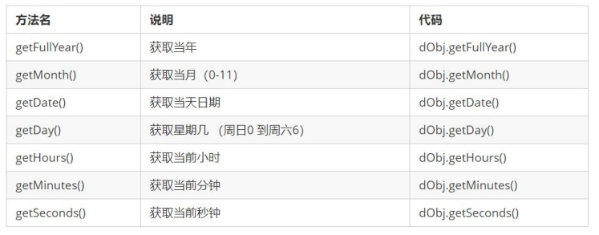

#### 16.4.4 获取日期的总的毫秒形式

Date 对象是基于1970年1月1日（世界标准时间）起的毫秒数

我们经常利用总的毫秒数来计算时间，因为它更精确

```JavaScript
// 实例化Date对象
var now = new Date();
// 1. 用于获取对象的原始值
console.log(date.valueOf()) // 现在时间距离1970.1.1总的毫秒数
console.log(date.getTime())
// 2. 简单写可以这么做
var now = + new Date();  // + new Date()返回的就是总的毫秒数
// 3. HTML5中提供的方法，有兼容性问题
var now = Date.now();
```


### 16.5 数组对象

#### 16.5.1 数组对象的创建

创建数组对象的两种方式：

- 字面量方式
- new Array()

```JavaScript
// 创建数组的两种方式
        // 1. 利用数组字面量
        var arr = [1, 2, 3];
        console.log(arr[0]);

        // 2. 利用new Array()
        // var arr1 = new Array();  // 创建了一个空的数组
        // var arr1 = new Array(2);  // 这个2 表示 数组的长度为 2  里面有2个空的数组元素 
        var arr1 = new Array(2, 3); // 等价于 [2,3]  这样写表示 里面有2个数组元素 是 2和3
        console.log(arr1);
```


#### 16.5.2 检测是否为数组

- instanceof运算符，可以判断一个对象是否属于某种类型

- Array.isArray()用于判断一个对象是否为数组，isArray() 是 HTML5 中提供的方法

  ```JavaScript
  var arr = [1, 23];
  var obj = {};
  console.log(arr instanceof Array); // true
  console.log(obj instanceof Array); // false
  console.log(Array.isArray(arr)); // true
  console.log(Array.isArray(obj)); // false
  ```

  

#### 16.5.3 添加删除数组元素的方法

| 方法名            | 说明                                                  | 返回值               |
| ----------------- | ----------------------------------------------------- | -------------------- |
| push(参数1...)    | 末尾添加一个或者多个元素，注意修改原数组              | 并返回新的长度       |
| pop()             | 删除最后一个元素，把数组长度减1，无参数，修改原数组   | 返回他删除的元素的值 |
| unshift(参数1...) | 向数组的开头添加一个或者更多元素，注意修改原数组      | 并返回新的长度       |
| shift()           | 删除数组第一个元素，把数组长度减1，无参数，修改原数组 | 并返回第一个元素的值 |


#### 16.5.4 数组排序

| 方法名      | 说明                         | 是否修改原数组                     |
| ----------- | ---------------------------- | ---------------------------------- |
| reverse（） | 颠倒数组中元素的顺序，无参数 | 该方法会改变原来的数组，返回新数组 |
| sort()      | 对数组元素进行排序           | 该方法会改变原来的数组，返回新数组 |

```javascript
// 数组排序
        // 1. 翻转数组
        var arr = ['pink', 'red', 'blue'];
        arr.reverse();
        console.log(arr);

        // 2. 数组排序（冒泡排序）
        var arr1 = [13, 4, 77, 1, 7];
        arr1.sort(function (a, b) {
            // return a - b; //升序
            return b - a; //降序
        });

        console.log(arr1);
```


#### 16.5.5 数组索引方法

| 方法名        | 说明                           |                                        |
| ------------- | ------------------------------ | -------------------------------------- |
| indexOf()     | 数组中查找给定元素的第一个索引 | 如果存在返回索引号，如果不存在，返回-1 |
| lastIndexOf() | 在数组中的最后一个索引         | 如果存在返回索引号，如果不存在，返回-1 |


#### 16.5.6  数组转换为字符串

| 方法名         | 说明                                         | 返回值         |
| -------------- | -------------------------------------------- | -------------- |
| toString()     | 把数组转换成字符串，逗号分隔每一项           | 返回一个字符串 |
| join('分隔符') | 方法用于把数组中的所有元素转换成为一个字符串 | 返回一个字符串 |

```javascript
        // 数组转换为字符串 
        // 1. toString() 将我们的数组转换为字符串
        var arr = [1, 2, 3];
        console.log(arr.toString()); // 1,2,3
        // 2. join(分隔符) 
        var arr1 = ['green', 'blue', 'pink'];
        console.log(arr1.join()); // green,blue,pink
        console.log(arr1.join('-')); // green-blue-pink
        console.log(arr1.join('&')); // green&blue&pink
```


#### 16.5.7 其他方法

| 方法名   | 说明                                     | 返回值                                        |
| -------- | ---------------------------------------- | --------------------------------------------- |
| concat() | 连接两个或多个数组 不影响原数组          | 返回一个新的数组                              |
| slice()  | 数组截取slice(begin,end)                 | 返回被截取项目的新数组                        |
| splice() | 数组删除splice(第几个开始，要删除的个数) | 返回被删除项目的新数组 注意，这个会影响原数组 |


### 16.6 字符串对象

#### 16.6.1 基本包装类型

为了方便操作基本数据类型，JavaScript 还提供了三个特殊的引用类型：String、Number和 Boolean。

**基本包装类型**就是把简单数据类型包装成为复杂数据类型，这样基本数据类型就有了属性和方法。

```JavaScript
// 下面代码有什么问题？
var str = 'andy';
console.log(str.length);
```

按道理基本数据类型是没有属性和方法的，而对象才有属性和方法，但上面代码却可以执行，这是因为 js 会把基本数据类型包装为复杂数据类型，其执行过程如下 ：

```JavaScript
// 1. 生成临时变量，把简单类型包装为复杂数据类型
var temp = new String('andy');
// 2. 赋值给我们声明的字符变量
str = temp;
// 3. 销毁临时变量
temp = null;
```


#### 16.6.2 字符串的不可变

指的是里面的值不可变，虽然看上去可以改变内容，但其实是地址变了，内存中新开辟了一个内存空间。

```JavaScript
var str = 'abc';
str = 'hello';
// 当重新给 str 赋值的时候，常量'abc'不会被修改，依然在内存中
// 重新给字符串赋值，会重新在内存中开辟空间，这个特点就是字符串的不可变
// 由于字符串的不可变，在大量拼接字符串的时候会有效率问题
var str = '';
for (var i = 0; i < 100000; i++) {
 str += i;
}
console.log(str); // 这个结果需要花费大量时间来显示，因为需要不断的开辟新的空间
```


#### 16.6.3 根据字符返回位置

字符串所有的方法，都不会修改字符串本身(字符串是不可变的)，操作完成会返回一个新的字符串。

| 方法名                              | 说明                                                         |
| ----------------------------------- | ------------------------------------------------------------ |
| indexOf('要查找的字符'，开始的位置) | 返回指定内容在字符串中的位置，如果找不到就返回-1，开始的位置是index索引号 |
| lastIndexOf()                       | 从后往前找，只找第一个匹配的                                 |


#### 16.6.4 根据位置返回字符（重点）

| 方法名            | 说明                                     | 使用                          |
| ----------------- | ---------------------------------------- | ----------------------------- |
| charAt(index)     | 返回指定位置的字符(index 字符串的索引号) | str.charAt(0)                 |
| charCodeAt(index) | 获取指定位置处的ASCII码(index索引号)     | str.charCodeAt(0)             |
| str[index]        | 获取指定位置处字符                       | HTML5，IE8+支持和charAt()等效 |

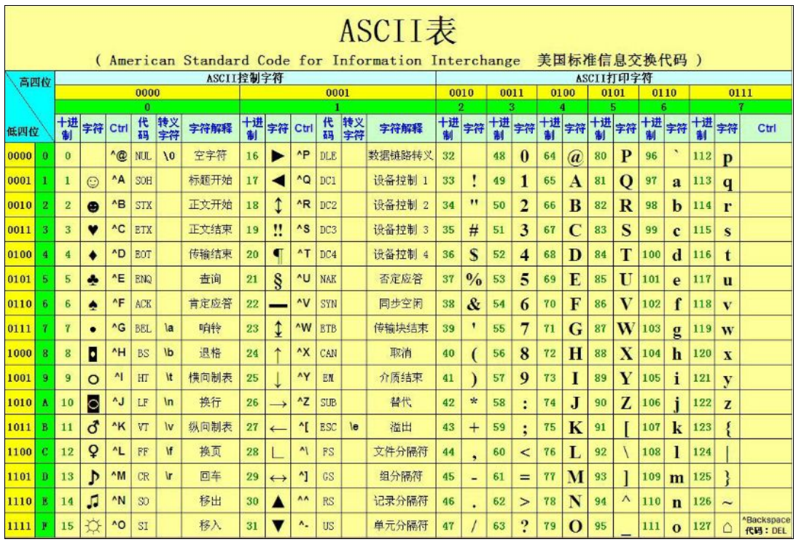

#### 16.6.5 字符串操作方法（重点）

| 方法名                    | 说明                                                         |
| ------------------------- | ------------------------------------------------------------ |
| concat(str1,str2,str3...) | concat()方法用于链接两个或多个字符串。拼接字符串，等效于+，+更方便 |
| substr(start,length)      | 从start位置开始(索引号)，length取的个数                      |
| slice(start,end)          | 从start位置开始，截取到end位置，end取不到（他们俩都是索引号） |
| substring(start,end)      | 从start位置开始，截取到end位置，end取不到 基本和slice相同 但是不接受负值 |


#### 16.6.6  replace()方法

replace() 方法用于在字符串中用一些字符替换另一些字符。

其使用格式如下： 

```
replace(被替换的字符串， 要替换为的字符串)；
```


#### 16.6.7 split()方法

split()方法用于切分字符串，它可以将字符串切分为数组。在切分完毕之后，返回的是一个新数组。

例如下面代码： 

```JavaScript
var str = 'a,b,c,d';
console.log(str.split(',')); // 返回的是一个数组 [a, b, c, d]
```


#### 16.6.8 转换大小写

- toUpperCase()  //转换大写

- toLowerCase()  //转换小写

## 17 简单类型与复杂类型

### 17.1 简单类型与复杂类型

简单类型又叫做基本数据类型或者值类型，复杂类型又叫做引用类型。 

- 值类型：简单数据类型/基本数据类型，在存储时变量中存储的是值本身，因此叫做值类型string ，number，boolean，undefined，null

  ```javascript
  // 简单数据类型 null  返回的是一个空的对象  object 
          var timer = null;
          console.log(typeof timer);
          // 如果有个变量我们以后打算存储为对象，暂时没想好放啥， 这个时候就给 null 
  ```

  

- 引用类型：复杂数据类型，在存储时变量中存储的仅仅是地址（引用），因此叫做引用数据类型。通过 new 关键字创建的对象（系统对象、自定义对象），如 Object、Array、Date等

### 17.2 堆和栈

堆栈空间分配区别：

- 栈（操作系统）：由操作系统自动分配释放存放函数的参数值、局部变量的值等。其操作方式类似于数据结构中的栈；

  简单数据类型存放到栈里面。

- 堆（操作系统）：存储复杂类型(对象)，一般由程序员分配释放，若程序员不释放，由垃圾回收机制回收。

  复杂数据类型存放到堆里面。

  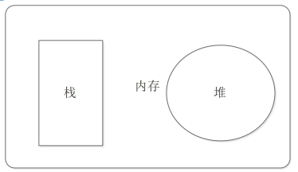

**注意：**JavaScript中没有堆栈的概念，通过堆栈的方式，可以让大家更容易理解代码的一些执行方式，便于将来学习其他语言。

### 17.3 简单类型的内存分配

- 值类型（简单数据类型）： string ，number，boolean，undefined，null

- 值类型变量的数据直接存放在变量（栈空间）中

  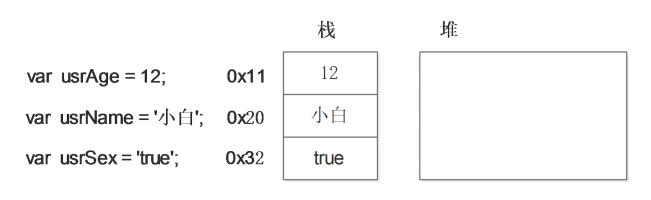

### 17.4 复杂类型的内存分配

- 引用类型（复杂数据类型）：通过 new 关键字创建的对象（系统对象、自定义对象），如 Object、Array、Date等 

- 引用类型变量（栈空间）里存放的是地址，真正的对象实例存放在堆空间中

  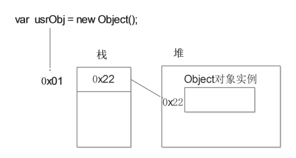

### 17.5 简单类型传参

函数的形参也可以看做是一个变量，当我们把一个值类型变量作为参数传给函数的形参时，其实是把变量在栈空间里的值复制了一份给形参，那么在方法内部对形参做任何修改，都不会影响到的外部变量。

```JavaScript
function fn(a) {
 a++;
 console.log(a); // 11
}
var x = 10;
fn(x);
console.log(x)； // 10
```


### 17.6 复杂类型传参

函数的形参也可以看做是一个变量，当我们把引用类型变量传给形参时，其实是把变量在栈空间里保存的堆地址复制给了形参，形参和实参其实保存的是同一个堆地址，所以操作的是同一个对象。

```javascript
function Person(name) {
 this.name = name;
}
function f1(x) { // x = p
 console.log(x.name); // 2. 这个输出什么 ? 刘德华
 x.name = "张学友";
 console.log(x.name); // 3. 这个输出什么 ? 张学友
}
var p = new Person("刘德华");
console.log(p.name); // 1. 这个输出什么 ? 刘德华
f1(p);
console.log(p.name); // 4. 这个输出什么 ? 张学友
```

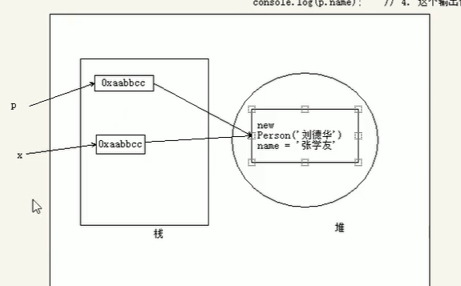

## 18 正则表达式

### 18.1 正则表达式简介


# Web APIs

## 1 Web APIs简介

### 1.1 Web APIs和 JS 基础关联性

#### 1.1.1  JS组成

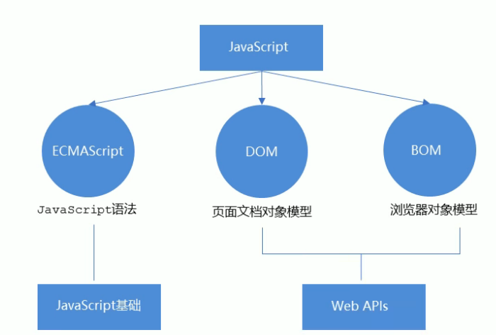

#### 1.1.2 JS基础阶段以及Web APIs阶段

- JS基础阶段
  - 学习的是ECMAScript标准规定的基本语法
  - 要掌握JS基础语法
  - 只学习基础语法，做不了网页交互效果
  - 目的是为了JS后面的内容打基础

- Web APIs阶段
  - web APIs是W3C组织的标准
  - web APIs主要学习DOM和BOM
  - web APIs是JS所独有的部分
  - 主要学习页面交互功能
  - JS基础内容做铺垫

### 1.2 API 和Web API

- API：API（Application Programming Interface, 应用程序编程接口）是一些预先定义的函数，目的是提供应用程序与开发人员基于某些软件或者硬件得以访问一组例程的能力，而又无需访问源码，或者理解内部工作机制的细节。

- Web API是浏览器提供的一套操作浏览器功能和页面元素的API（BOM和DOM）。

- 小结：

  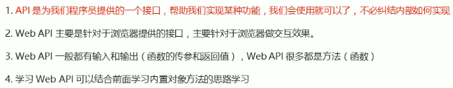


## 2 DOM

### 2.1 DOM简介

- 文档对象模型（Document Object Model，简称 DOM），是 W3C 组织推荐的处理可扩展标记语言（HTML或者XML）的标准编程接口。

  W3C 已经定义了一系列的 DOM 接口，通过这些 DOM 接口可以改变网页的内容、结构和样式。

- DOM树

  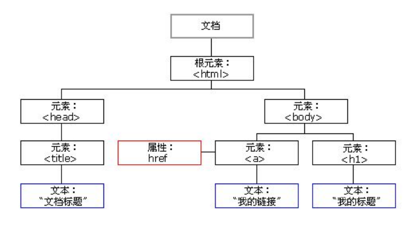

  - 文档：一个页面就是一个文档，DOM 中使用 document 表示
  - 元素：页面中的所有标签都是元素，DOM中使用element表示
  - 节点：网页中的所有内容都是节点（标签、属性、文本、注释等），DOM中使用node表示
  - **DOM把以上内容都看作是对象**

### 2.2 获取元素

#### 2.2.1 如何获取页面元素

DOM在我们实际开发中主要用来操作元素。

我们如何来获取页面中的元素呢?

获取页面中的元素可以使用以下几种方式:

- 根据ID获取
- 根据标签名获取
- 通过HTML5新增的方法获取
- 特殊元素获取

#### 2.2.2 根据ID获取

使用getElementById()方法可以获取带有ID的元素对象。

```javascript
document.getElementById('id');
```

使用console.dir()可以打印我们获取的元素对象，更好的查看对象里面的属性和方法。

#### 2.2.3 根据标签名获取

使用getElemenntsByTagName()方法可以返回带有指定标签名的对象集合。

```javascript
document.getElemensByTagName('标签名');
```

注意：

1. 因为得到的是一个对象的集合，所以我们想要操作里面的元素就需要遍历。
2. 得到元素对象是动态的。

#### 2.2.4 通过 HTML5 新增的方法获取

```javascript
1. document.getElementsByClassName('类名'); // 根据类名返回元素对象集合
```

```javascript
2. document.querySelector('选择器');// 根据指定选择器返回第一个元素对象
```

```javascript
3. document.querySelectorAll('选择器');  // 根据指定选择器返回
```

注意：querySelector 和 querySelectorAll里面的选择器需要加符号，比如 document.querySelector('#nav');

#### 2.2.5 获取特殊元素(body,html)

获取body元素

```javascript
1. document.body  // 返回body元素对象
```

获取html元素

```javascript
1. document.documentElement // 返回html元素对象
```

 

### 2.3 事件基础

#### 2.3.1 事件概述

JavaScript 使我们有能力创建动态页面，而事件是可以被 JavaScript 侦测到的行为。

简单理解： 触发--- 响应机制。

网页中的每个元素都可以产生某些可以触发 JavaScript 的事件，例如，我们可以在用户点击某按钮时产生一个事件，然后去执行某些操作。

#### 2.3.2 事件三要素

1. 事件源 （谁）

2. 事件类型 （什么事件）

3. 事件处理程序 （做啥）

- 案例：页面中有一个按钮，当鼠标点击按钮的时候，弹出“你好”警示框。

  ① 获取事件源（按钮）

  ② 注册事件（绑定事件），使用 onclick

  ③ 编写事件处理程序，写一个函数弹出 alert 警示框

  ```javascript
  var btn = document.getElementById('btn');
  btn.onclick = function() {
   alert('你好吗'); 
  };
  ```

#### 2.3.3 执行事件的步骤

1. 获取事件源

2. 注册事件（绑定事件）

3. 添加事件处理程序（采取函数赋值形式）

#### 2.3.4 常见的鼠标事件

| 鼠标事件    | 触发条件         |
| ----------- | ---------------- |
| onclick     | 鼠标点击左键触发 |
| onmouseover | 鼠标经过触发     |
| onmouseout  | 鼠标离开触发     |
| onfocus     | 获得鼠标焦点触发 |
| onblur      | 失去鼠标焦点触发 |
| onmousemove | 鼠标移动触发     |
| onmouseup   | 鼠标谈起触发     |
| onmousedown | 鼠标按下触发     |


### 2.4 操作元素

JavaScript 的 DOM 操作可以改变网页内容、结构和样式，我们可以利用 DOM 操作元素来改变元素里面的内容 、属性等。注意以下都是属性。

#### 2.4.1 改变元素内容

```javascript
element.innerText
```

从起始位置到终止位置的内容, 但它去除 html 标签， 同时空格和换行也会去掉.

```javascript
element.innerHTML
```

起始位置到终止位置的全部内容，包括 html 标签，同时保留空格和换行。

```html
// 例子
<body>
    <div></div>
    <p>
        我是文字
        <span>123</span>
    </p>
    <script>
        // innerText 和 innerHTML的区别 
        // 1. innerText 不识别html标签 非标准  去除空格和换行
        var div = document.querySelector('div');
        // div.innerText = '<strong>今天是：</strong> 2019';
        // 2. innerHTML 识别html标签 W3C标准 保留空格和换行的
        div.innerHTML = '<strong>今天是：</strong> 2019';
        // 这两个属性是可读写的  可以获取元素里面的内容
        var p = document.querySelector('p');
        console.log(p.innerText);
        console.log(p.innerHTML);
    </script>
</body>
```

#### 2.4.2 常用元素的属性操作

```
1. innerText、innerHTML 改变元素内容
2. src、href
3. id、alt、title
```

```html
<button id="ldh">刘德华</button>
    <button id="zxy">张学友</button> <br>
    

    <script>
        // 修改元素属性  src
        // 1. 获取元素
        var ldh = document.getElementById('ldh');
        var zxy = document.getElementById('zxy');
        var img = document.querySelector('img');
        // 2. 注册事件  处理程序
        zxy.onclick = function () {
            img.src = 'images/zxy.jpg';
            img.title = '张学友';
        }
        ldh.onclick = function () {
            img.src = 'images/ldh.jpg';
            img.title = '刘德华';
        }
    </script>
```

#### 2.4.3 表单元素的属性操作

利用 DOM 可以操作如下表单元素的属性：

```html
 type、value、checked、selected、disabled
```

```html
<button>按钮</button>
    <input type="text" value="输入内容">
    <script>
        // 1. 获取元素
        var btn = document.querySelector('button');
        var input = document.querySelector('input');
        // 2. 注册事件 处理程序
        btn.onclick = function () {
            // input.innerHTML = '点击了';  这个是 普通盒子 比如 div 标签里面的内容
            // 表单里面的值 文字内容是通过 value 来修改的
            input.value = '被点击了';
            // 如果想要某个表单被禁用 不能再点击 disabled  我们想要这个按钮 button禁用
            // btn.disabled = true;
            this.disabled = true;

            // this 指向的是事件函数的调用者 btn
        }
    </script>
```

#### 2.4.4 样式属性操作

我们可以通过 JS 修改元素的大小、颜色、位置等样式。

```javascript
1. element.style 行内样式操作
2. element.className 类名样式操作
```

**注意**：

1. JS 里面的样式采取驼峰命名法 比如 fontSize、backgroundColor

2. JS 修改 style 样式操作，产生的是行内样式，CSS 权重比较高
3. 如果样式修改较多，可以采取操作类名方式更改元素样式。
4.  class因为是个保留字，因此使用className来操作元素类名属性。
5.  className 会直接更改元素的类名，会覆盖原先的类名。

```html
// 例子1
<style>
        div {
            width: 200px;
            height: 200px;
            background-color: pink;
        }
    </style>


<body>
    <div>

    </div>
    <script>
        //1.获取元素
        var div = document.querySelector('div');
        //2.注册事件 处理程序
        div.onclick = function () {
            // div.style里面的属性 采取驼峰命名法 
            this.style.backgroundColor = 'purple';
            this.style.width = '250px';
        }
    </script>
</body>
```

```html
// 例子2
<style>
        div {
            width: 100px;
            height: 100px;
            background-color: pink;
        }

        .change {
            background-color: purple;
            color: #fff;
            font-size: 25px;
            margin-top: 100px;
        }
    </style>


<body>
    <div class="first">文本</div>
    <script>
        // 1. 使用 element.style 获得修改元素样式  如果样式比较少 或者 功能简单的情况下使用
        var test = document.querySelector('div');
        test.onclick = function () {
            // this.style.backgroundColor = 'purple';
            // this.style.color = '#fff';
            // this.style.marginTop = '100px';
            // 让我们当前元素的类名改为了 change

            // 2. 我们可以通过 修改元素的className更改元素的样式 适合于样式较多或者功能复杂的情况
            // this.className = 'change';
            // 3. 如果想要保留原先的类名，我们可以这么做 多类名选择器
            this.className = 'first change';
        }
    </script>
</body>
```


#### 2.4.5 操作元素总结

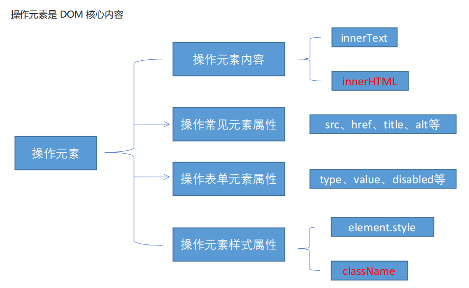

#### 2.4.6 排他思想


如果有同一组元素，我们想要某一个元素实现某种样式， 需要用到循环的排他思想算法：

1. 所有元素全部清除样式（干掉其他人）

2. 给当前元素设置样式 （留下我自己）

3. 注意顺序不能颠倒，首先干掉其他人，再设置自己

   ```html
   <body>
       <button>按钮1</button>
       <button>按钮2</button>
       <button>按钮3</button>
       <button>按钮4</button>
       <button>按钮5</button>
       <script>
           //1.获取所有按钮元素
           var btn = document.getElementsByTagName('button');
           //btns得到的是伪数组，里面的每一个元素btn[i]
           for (var i = 0; i < btn.length; i++) {
               btn[i].onclick = function () {
                   for (var i = 0; i < btn.length; i++) {
                       btn[i].style.backgroundColor = '';
                   }
                   this.style.backgroundColor = 'pink';
               }
           }
       </script>
   </body>
   ```

   

#### 2.4.7 自定义属性的操作

1. 获取属性值

   - element.属性 获取属性值。

   - element.getAttribute('属性');

   **区别：**

   - element.属性 获取内置属性值（元素本身自带的属性）

   - element.getAttribute(‘属性’); 主要获得自定义的属性 （标准） 我们程序员自定义的属性

2. 设置属性值

   - element.属性 = ‘值’ 设置内置属性值。

   -  element.setAttribute('属性', '值');

   **区别：**

   - element.属性 设置内置属性值 

   - element.setAttribute(‘属性’); 主要设置自定义的属性 （标准）

3. 移除属性

   - element.removeAttribute('属性');

```html
<body>
    <div id="demo" index='1'></div>
    <script>
        var div = document.querySelector('div');
        //1.获取元素的属性值
        //(1)element.属性
        console.log(div.id);
        //(2) element.getAttribute('属性')  get得到获取 attribute 属性的意思 我们程序员自己添加的属性我们称为自定义属性 index
        console.log(div.getAttribute('id'));
        console.log(div.getAttribute('index'));

        // 2. 设置元素属性值
        // (1) element.属性= '值'
        div.id = 'text';
        div.className = 'navs';
        // (2) element.setAttribute('属性', '值');  主要针对于自定义属性
        div.setAttribute('index', '2');
        div.setAttribute('class', 'footer');
        // class 特殊  这里面写的就是class 不是className
        // 3. 移除属性 element.removeAttribute(属性)  
        div.removeAttribute('index');
    </script>
</body>
```

##### 2.4.8 H5自定义属性

**自定义属性目的：是为了保存并使用数据。有些数据可以保存到页面中而不用保存到数据库中。**

自定义属性获取是通过getAttribute(‘属性’) 获取。

但是有些自定义属性很容易引起歧义，不容易判断是元素的内置属性还是自定义属性。

H5给我们新增了自定义属性:

1. 设置H5自定义属性

   H5规定自定义属性data-开头做为属性名并且赋值。

   比如 \<div data-index="1">\</div>

   或者使用 JS 设置 

   element.setAttribute(‘data-index’, 2)

2. 获取H5自定义属性

   兼容性获取 element.getAttribute(‘data-index’);

   H5新增 element.dataset.index 或者 element.dataset[‘index’] ie 11才开始支持

### 2.5 节点操作

#### 2.5.1 为什么学节点操作

获取元素通常使用两种方式：

1. 利用 DOM 提供的方法获取元素

   - document.getElementById() 

   - document.getElementsByTagName()

   - document.querySelector 等 

   - 逻辑性不强、繁琐

2. 利用节点层级关系获取元素

   - 利用父子兄节点关系获取元素

   - 逻辑性强， 但是兼容性稍差

#### 2.5.2 节点概述

网页中的所有内容都是节点（标签、属性、文本、注释等），在DOM 中，节点使用 node 来表示。

HTML DOM 树中的所有节点均可通过 JavaScript 进行访问，所有 HTML 元素（节点）均可被修改，也可以创建或删除。

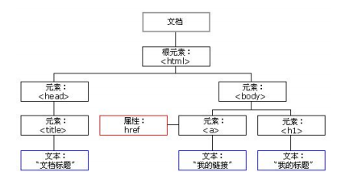

一般地，节点至少拥有nodeType（节点类型）、nodeName（节点名称）和nodeValue（节点值）这三个基本属性。 

- 元素节点 nodeType 为 1
- 属性节点 nodeType 为 2
- 文本节点 nodeType 为 3 （文本节点包含文字、空格、换行等）

我们在实际开发中，节点操作主要操作的是**元素节点**


#### 2.5.3 节点层级

利用 DOM 树可以把节点划分为不同的层级关系，常见的是**父子兄层级关系**。

1. 父级节点

   ```html
   node.parentNode
   ```

   - parentNode 属性可返回某节点的父节点，注意是最近的一个父节点
   - 如果指定的节点没有父节点则返回 null 

2. 子节点

   ```
   1. parentNode.childNodes(标准)
   ```

   parentNode.childNodes 返回包含指定节点的子节点的集合，该集合为即时更新的集合。

   **注意：**返回值里面包含了所有的子节点，包括元素节点，文本节点等。

   如果只想要获得里面的元素节点，则需要专门处理。 所以我们一般不提倡使用childNodes。

   ```JavaScript
   var ul = document. querySelector(‘ul’);
   for(var i = 0; i < ul.childNodes.length;i++) {
   if (ul.childNodes[i].nodeType == 1) {
    // ul.childNodes[i] 是元素节点
    console.log(ul.childNodes[i]);
   }}
   ```

   ```
   2.parentNode.children（非标准）
   ```

   parentNode.children 是一个只读属性，返回所有的子元素节点。它只返回子元素节点，其余节点不返

   回 （**这个是我们重点掌握的**）。

   虽然children 是一个非标准，但是得到了各个浏览器的支持，因此我们可以放心使用。

   ```
   3. parentNode.firstChild
   ```

   firstChild 返回第一个子节点，找不到则返回null。同样，也是包含所有的节点。

   ```
    4. parentNode.lastChild
   ```

   lastChild 返回最后一个子节点，找不到则返回null。同样，也是包含所有的节点。

   ```
    5. parentNode.firstElementChild
   ```

   firstElementChild 返回第一个子元素节点，找不到则返回null。

   ```
    6. parentNode.lastElementChild
   ```

   lastElementChild 返回最后一个子元素节点，找不到则返回null。 

   注意：5，6两个方法有兼容性问题，IE9 以上才支持。

   

   实际开发中，firstChild 和 lastChild 包含其他节点，操作不方便，而 firstElementChild 和

   lastElementChild 又有兼容性问题，那么我们如何获取第一个子元素节点或最后一个子元素节点呢？

   **解决方案：**

   1. 如果想要第一个子元素节点，可以使用 parentNode.children[0] 

   2. 如果想要最后一个子元素节点，可以使用 parentNode.chilren[parentNode.chilren.length - 1] 

3. 兄弟节点

   ```
   1. node.nextSibling
   ```

   nextSibling 返回当前元素的下一个兄弟元素节点，找不到则返回null。同样，也是包含所有的节点。

   ```
   2. node.previousSibling
   ```

   previousSibling 返回当前元素上一个兄弟元素节点，找不到则返回null。同样，也是包含所有的节点。

   ```
    3. node.nextElementSibling
   ```

   nextElementSibling 返回当前元素下一个兄弟元素节点，找不到则返回null。

   ```
    4. node.previousElementSibling
   ```

   previousElementSibling 返回当前元素上一个兄弟节点，找不到则返回null。

   注意：4，5两个方法有兼容性问题， IE9 以上才支持。

   **问：如何解决兼容性问题 ？**

   答：自己封装一个兼容性的函数 

   ```JavaScript
   function getNextElementSibling(element) {
    var el = element;
    while (el = el.nextSibling) {
    if (el.nodeType === 1) {
    return el;
    }
    }
    return null;
    }
   ```

   

#### 2.5.4 创建节点

```
 document.createElement('tagName')
```

document.createElement() 方法创建由 tagName 指定的 HTML 元素。因为这些元素原先不存在，是根据我们的需求动态生成的，所以我们也称为动态创建元素节点。


#### 2.5.5 添加节点

```
 1. node.appendChild(child)
```

node.appendChild() 方法将一个节点添加到指定父节点的子节点列表末尾。类似于 CSS 里面的after 伪元素。

```
 2. node.insertBefore(child, 指定元素)
```

node.insertBefore() 方法将一个节点添加到父节点的指定子节点前面。类似于 CSS 里面的 before 伪元素。


#### 2.5.6 删除节点

```
node.removeChild(child)
```

node.removeChild() 方法从 DOM 中删除一个子节点，返回删除的节点。


#### 2.5.7 复制节点（克隆节点）

```
 node.cloneNode()
```

node.cloneNode() 方法返回调用该方法的节点的一个副本。 也称为克隆节点/拷贝节点。

**注意：**

1. 如果括号参数为空或者为 false ，则是浅拷贝，即只克隆复制节点本身，不克隆里面的子节点。

2. 如果括号参数为 true ，则是深度拷贝，会复制节点本身以及里面所有的子节点。


#### 2.7.8 三种动态创建元素区别

- document.write()

- element.innerHTML

- document.createElement()

**区别**

1. document.write 是直接将内容写入页面的内容流，但是文档流执行完毕，则它会导致页面全部重绘

2. innerHTML 是将内容写入某个 DOM 节点，不会导致页面全部重绘

3. innerHTML 创建多个元素效率更高（不要拼接字符串，采取数组形式拼接），结构稍微复杂

4. createElement() 创建多个元素效率稍低一点点，但是结构更清晰

**总结**：不同浏览器下，innerHTML 效率要比 creatElement 高

### 2.6 DOM核心

文档对象模型（Document Object Model，简称 DOM），是 W3C 组织推荐的处理可扩展标记语言（HTML或者XML）的标准编程接口。 

W3C 已经定义了一系列的 DOM 接口，通过这些 DOM 接口可以改变网页的内容、结构和样式。

1. 对于JavaScript，为了能够使JavaScript操作HTML，JavaScript就有了一套自己的dom编程接口。

2. 对于HTML，dom使得html形成一棵dom树. 包含 文档、元素、节点

我们获取过来的DOM元素是一个对象（object），所以称为文档对象模型。

关于dom操作，主要针对于元素的操作。主要有创建、增、删、改、查、属性操作、事件操作。

#### 2.6.1 创建

1. document.write

2. innerHTML

3. createElement

#### 2.6.2 增

1. appendChild

2. insertBefore

#### 2.6.3 删

1. removeChild

#### 2.6.4 改

主要修改dom的元素属性，dom元素的内容、属性, 表单的值等

1. 修改元素属性： src、href、title等

2. 修改普通元素内容： innerHTML 、innerText

3. 修改表单元素： value、type、disabled等

4. 修改元素样式： style、className

#### 2.6.5 查

主要获取查询dom的元素

1. DOM提供的API 方法：getElementByIdgetElementsByTagName 古老用法 不太推荐

2. H5提供的新方法： querySelector、querySelectorAll 提倡

3. 利用节点操作获取元素： 父(parentNode)、子(children)、兄(previousElementSibling、nextElementSibling) 提倡

#### 2.6.6 属性操作

主要针对于自定义属性。

1. setAttribute：设置dom的属性值

2. getAttribute：得到dom的属性值

3. removeAttribute移除属性

#### 2.6.7 事件操作

给元素注册事件， 采取 事件源.事件类型 = 事件处理程序

| 鼠标事件    | 触发条件         |
| ----------- | ---------------- |
| onclick     | 鼠标点击左键触发 |
| onmouseover | 鼠标经过触发     |
| onmouseout  | 鼠标离开触发     |
| onfocus     | 获得鼠标焦点触发 |
| onblur      | 失去鼠标焦点触发 |
| onmousemove | 鼠标移动触发     |
| onmouseup   | 鼠标弹起触发     |
| onmousedown | 鼠标按下触发     |


# JS高级